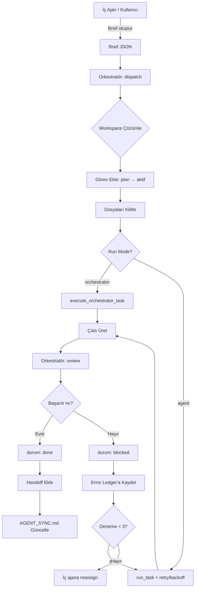

# 07 - Harici Ajan Entegrasyon Protokolü

Bu belge, proje dışından gelen yapay zeka ajanlarının (Cursor Grok, GitHub Copilot, Claude Code vb.) kontrollü ve güvenli şekilde projeye dahil edilme kurallarını tanımlar.

> **Temel İlke:** Harici ajanlar proje köküne doğrudan erişemez; yalnızca `workspace/external/{agent_id}/` workspace'i üzerinden çalışır. Tüm etkileşim orkestratör üzerinden yürütülür.

---

## 1. Kapsam ve Amaç

### 1.1 Neden Harici Ajanlar?

- **Uzmanlık çeşitliliği:** Farklı LLM tabanlı ajanlar farklı görevlerde güçlüdür (kod analizi, test üretimi, dokümantasyon)
- **Paralel iş gücü:** Birden fazla ajan aynı anda farklı görevlerde çalışabilir
- **Maliyet optimizasyonu:** Basit görevler için daha ucuz ajanlar, karmaşık görevler için güçlü ajanlar

### 1.2 Güvenlik Sınırları

| Kural | Açıklama |
|-------|----------|
| **Workspace izolasyonu** | Harici ajan yalnızca `workspace/external/{agent_id}/` altında çalışır |
| **Gizli veri yasağı** | `.env`, API anahtarları, KVKK verileri **asla** gönderilmez |
| **İnsan onayı** | Harici ajan çıktısı güvenilir değildir; orkestratör + kalite ajanı + insan onayı döngüsünden geçmeden ana dala alınmaz |
| **Maksimum deneme** | Başarısızlık durumunda **maksimum 3 deneme**, sonrasında iç ajanlara reassign yapılır |
| **Hata kaydı** | Tüm hatalar `AGENT_SYNC.md` → "ErrorLedger" bölümüne kaydedilir |

---

## 2. Desteklenen Ajanlar

### 2.1 Ajan Manifest Kaydı

Her harici ajan, [`src/company_master/orchestrator/cli.py`](../../src/company_master/orchestrator/cli.py:26) içinde `MANIFESTS` sözlüğünde tanımlıdır:

```python
MANIFESTS: dict[str, AgentManifest] = {
    "cursor_grok": AgentManifest(
        agent_id="cursor_grok",
        display_name="Cursor Grok",
        task_type="code_review",
        workspace_path="workspace/external/cursor_grok",
        max_attempts=3,
        timeout_seconds=300,
    ),
    "copilot": AgentManifest(
        agent_id="copilot",
        display_name="GitHub Copilot",
        task_type="refactoring",
        workspace_path="workspace/external/copilot",
        max_attempts=3,
        timeout_seconds=300,
    ),
    "claude_code": AgentManifest(
        agent_id="claude_code",
        display_name="Claude Code",
        task_type="research",
        workspace_path="workspace/external/claude_code",
        max_attempts=3,
        timeout_seconds=300,
    ),
    "roo_code": AgentManifest(
        agent_id="roo_code",
        display_name="Roo Code",
        task_type="code_review",
        workspace_path="workspace/external/roo_code",
        max_attempts=3,
        timeout_seconds=300,
    ),
    "harici_ajan": AgentManifest(
        agent_id="harici_ajan",
        display_name="Harici Ajan (Inkling)",
        task_type="research",
        workspace_path="workspace/external/harici_ajan",
        max_attempts=3,
        timeout_seconds=300,
    ),
}
```

### 2.2 Ajan → Görev Tipi Eşlemesi

| Ajan | Güçlü Yönler | Önerilen Görev Tipleri |
|------|--------------|------------------------|
| **Cursor Grok** | Hızlı kod analizi, Streamlit/Python, çoklu dosya taraması | Code Review, Test Üretme |
| **GitHub Copilot** | Snippet üretimi, boilerplate, CI/CD şablonları | Refactoring, CI/CD |
| **Claude Code** | Uzun bağlam okuma, mimari dokümantasyon, güvenlik review | Dokümantasyon, Araştırma, Güvenlik Audit |
| **Roo Code** | Kod incelemesi, refactoring önerileri | Code Review, Refactoring |

Detaylı görev önerileri: [[08_harici_ajan_gorev_onerileri]]

---

## 3. Görev Akışı

### 3.1 Genel Akış Diyagramı



### 3.2 Adım Adım Süreç

#### Adım 1: Brief Oluşturma

Harici ajana gönderilecek görev, JSON formatında brief dosyası olarak hazırlanır:

```json
{
  "agent_id": "claude_code",
  "task_id": "RESEARCH-01",
  "task_type": "research",
  "title": "API araştırması",
  "brief_path": "workspace/external/claude_code/brief.json",
  "context_files": ["docs/api_spec.md"],
  "constraints": {
    "max_tokens": 3000,
    "no_db_schema_access": true,
    "no_env_access": true
  },
  "success_criteria": [
    "API endpoint listesi",
    "Örnek kullanım kodu",
    "file: output/api_research.md"
  ],
  "deadline": "2026-09-12T18:00:00",
  "source": "harici",
  "run_mode": "orchestrator"
}
```

**Zorunlu Alanlar:**
- `agent_id`: Ajan kimliği (MANIFESTS'te tanımlı olmalı)
- `task_id`: Benzersiz görev kimliği
- `task_type`: Görev tipi (`code_review`, `refactoring`, `test_generation`, `documentation`, `data_transformation`, `research`)
- `title`: Görev başlığı

**Opsiyonel Alanlar:**
- `context_files`: Ajanın okuyabileceği dosya yolları (workspace içinde olmalı)
- `constraints`: Kısıtlar (token limiti, erişim yasakları)
- `success_criteria`: Başarı ölçütleri (dosya: prefix ile zorunlu dosyalar belirtilebilir)
- `deadline`: Son teslim tarihi
- `source`: "ic" veya "harici"
- `run_mode`: "orchestrator" (iç çalışma) veya "agent" (harici subprocess)

#### Adım 2: Dispatch (Görev Dağıtımı)

```bash
python -m src.company_master.orchestrator.cli dispatch workspace/external/claude_code/brief.json
```

**İç Akış:**
1. Brief validasyonu ([`brief.py`](../../src/company_master/orchestrator/brief.py:15))
2. Ajan manifest kontrolü
3. Workspace çözümleme ([`workspace.py`](../../src/company_master/orchestrator/workspace.py))
4. Görev ekleme: `plan → aktif` ([`task_board.py`](../../src/company_master/orchestrator/task_board.py:53))
5. Dosya kilitleme
6. Görev çalıştırma ([`runner.py`](../../src/company_master/orchestrator/runner.py))

#### Adım 3: Review (Çıktı İncelemesi)

```bash
python -m src.company_master.orchestrator.cli review RESEARCH-01 --output-dir workspace/external/claude_code/output/
```

**İç Akış:**
1. Output path kontrolü
2. Secret taraması ([`workspace.py`](../../src/company_master/orchestrator/workspace.py) → `scan_for_secrets()`)
3. Zorunlu dosya kontrolü
4. Başarı/başarısızlık kararı
5. Durum güncelleme: `done` veya `blocked`
6. Handoff ekleme (başarılıysa)
7. AGENT_SYNC.md güncelleme

#### Adım 4: Handoff ve Senkronizasyon

Başarılı görevler [`handoffs.json`](../../data/orchestrator/handoffs.json) dosyasına kaydedilir:

```json
{
  "task_id": "RESEARCH-01",
  "agent_id": "claude_code",
  "tamamlanma": "2026-09-11T16:30:00",
  "sonraki_adim": "İç ajana entegrasyon",
  "output_path": "workspace/external/claude_code/output/",
  "ozet": "API araştırması tamamlandı, 5 endpoint bulundu",
  "guncelleme_gecmisi": [
    {
      "tarih": "2026-09-11T16:30:00",
      "ozet": "İlk tamamlanma"
    }
  ]
}
```

---

## 4. Güvenlik Kuralları

### 4.1 Workspace İzolasyonu

Harici ajanlar **yalnızca** kendi workspace dizinlerinde çalışabilir:

```
workspace/external/
├── cursor_grok/
│   ├── brief.json
│   ├── output/
│   └── logs/
├── copilot/
│   ├── brief.json
│   ├── output/
│   └── logs/
├── claude_code/
│   ├── brief.json
│   ├── output/
│   └── logs/
└── roo_code/
    ├── brief.json
    ├── output/
    └── logs/
```

**Path Traversal Koruması:**
```python
from src.company_master.orchestrator.workspace import validate_write_path

# Güvenli path
validate_write_path("claude_code", "workspace/external/claude_code/output/result.md")
# → OK

# Tehlikeli path (proje köküne çıkış)
validate_write_path("claude_code", "../../../src/company_master/db/connection.py")
# → WorkspaceViolation: Path traversal detected
```

### 4.2 Gizli Veri Yasağı

Harici ajana **asla** gönderilmeyecek veriler:

| Veri Tipi | Örnek | Neden Yasak? |
|-----------|-------|--------------|
| `.env` dosyası | `DATABASE_URL=postgresql://...` | Veritabanı kimlik bilgileri |
| API anahtarları | `APIFY_TOKEN=apify_api_...` | Üçüncü parti servis erişimi |
| KVKK verileri | `vkn: "1234567890"` | Kişisel veri koruma |
| Üretim şeması | `CREATE TABLE companies...` | Veritabanı yapısı |
| Gizli anahtarlar | `SECRET_KEY=django-insecure-...` | Uygulama güvenliği |

**Secret Taraması:**
```python
from src.company_master.orchestrator.workspace import scan_for_secrets

findings = scan_for_secrets("workspace/external/claude_code/output/")
# ["Found potential API key in output/config.json: line 12"]
```

### 4.3 Dosya Erişim Kontrolü

Harici ajanın okuyabileceği dosyalar **brief'te açıkça belirtilmelidir**:

```json
{
  "context_files": [
    "docs/api_spec.md",
    "src/company_master/orchestrator/README.md"
  ]
}
```

**Yasak Erişimler:**
- `src/company_master/db/` (veritabanı bağlantı kodu)
- `src/company_master/schema/` (üretim şeması)
- `.env`, `.env.example`
- `data/` altındaki ham veriler (KVKK riski)

---

## 5. Hata Yönetimi

### 5.1 Retry Mekanizması

Harici ajan görevleri başarısız olduğunda **maksimum 3 deneme** yapılır:

```python
MAX_ATTEMPTS = 3

def retry_istatistikleri(task_id: str) -> dict:
    """Görev için retry istatistikleri (context decay için)."""
    gorev = gorev_getir(task_id)
    if not gorev:
        return {"attempts": 0, "backoff_sn": 0, "context_mode": "full"}

    attempts = gorev.get("attempts", 0)

    # Exponential context decay: her retry'de context %50 azalır
    if attempts <= 1:
        mode = "full"       # ~3000 token
    elif attempts == 2:
        mode = "hatali"     # ~1000 token (sadece hata + dosyanın değişen kısımları)
    else:
        mode = "handoff"    # ~500 token (sadece handoff)

    backoff_sn = 2 ** (attempts - 1) * 60  # 60s, 120s, 240s

    return {"attempts": attempts, "backoff_sn": backoff_sn, "context_mode": mode}
```

### 5.2 Error Ledger

Tüm hatalar [`workspace/.error_ledger.json`](../../workspace/.error_ledger.json) dosyasına kaydedilir:

```json
{
  "entries": [
    {
      "task_id": "RESEARCH-01",
      "agent_id": "claude_code",
      "timestamp": "2026-09-11T16:30:00",
      "error_type": "timeout",
      "error_message": "Task execution timed out after 300 seconds",
      "attempt": 1,
      "action": "retry"
    }
  ]
}
```

### 5.3 Reassign (İç Ajanlara Yönlendirme)

3 deneme sonrası başarısızlık durumunda görev iç ajana yönlendirilir:

```python
if task.attempts >= MAX_ATTEMPTS:
    # İç ajana reassign
    gorev_guncelle(task_id, durum="reassigned", not="Harici ajan başarısız, iç ajana yönlendirildi")
    # Koordinatör ajana bildirim
    handoff_ekle(task_id, "koordinator", "", "Reassign: harici ajan başarısız")
```

---

## 6. Görev Tipleri

Harici ajanlara atanabilecek 6 temel görev tipi:

### 6.1 Code Review
- **Amaç:** Mevcut kodları gözden geçirme, iyileştirme önerileri
- **Örnek Brief:**
```json
{
  "task_type": "code_review",
  "title": "ETL pipeline code review",
  "context_files": ["src/company_master/etl/pipeline.py"],
  "success_criteria": ["En az 3 iyileştirme önerisi", "file: output/review.md"]
}
```

### 6.2 Refactoring
- **Amaç:** Kod optimizasyonu, design pattern uyumu
- **Örnek Brief:**
```json
{
  "task_type": "refactoring",
  "title": "Normalize fonksiyonunu optimize et",
  "context_files": ["src/company_master/etl/normalize.py"],
  "success_criteria": ["Performans artışı", "file: output/refactored_normalize.py"]
}
```

### 6.3 Test Üretme
- **Amaç:** Unit test, integration test senaryoları
- **Örnek Brief:**
```json
{
  "task_type": "test_generation",
  "title": "Entity resolution testleri",
  "context_files": ["src/company_master/etl/entity_resolution.py"],
  "success_criteria": ["Coverage >= %85", "file: output/test_entity_resolution.py"]
}
```

### 6.4 Dokümantasyon
- **Amaç:** README, yorum, API dokümanları
- **Örnek Brief:**
```json
{
  "task_type": "documentation",
  "title": "Orchestrator README yaz",
  "context_files": ["src/company_master/orchestrator/"],
  "success_criteria": ["Tüm modüller açıklanmış", "file: output/README.md"]
}
```

### 6.5 Veri Dönüşümü
- **Amaç:** CSV/JSON dönüşümleri, migration helper
- **Örnek Brief:**
```json
{
  "task_type": "data_transformation",
  "title": "OSTİM verisi JSONL'e dönüştür",
  "context_files": ["data/ostim/firmalar.csv"],
  "success_criteria": ["Geçerli JSONL", "file: output/firmalar.jsonl"]
}
```

### 6.6 Araştırma
- **Amaç:** Teknoloji karşılaştırma, benchmark
- **Örnek Brief:**
```json
{
  "task_type": "research",
  "title": "Vector DB karşılaştırması",
  "context_files": ["docs/requirements.md"],
  "success_criteria": ["En az 3 alternatif", "file: output/vector_db_comparison.md"]
}
```

---

## 7. Örnek Kullanım Senaryoları

### Senaryo 1: Cursor Grok ile Code Review

```bash
# 1. Brief oluştur
cat > workspace/external/cursor_grok/brief.json <<EOF
{
  "agent_id": "cursor_grok",
  "task_id": "CR-001",
  "task_type": "code_review",
  "title": "ETL pipeline code review",
  "context_files": ["src/company_master/etl/pipeline.py"],
  "constraints": {"max_tokens": 3000},
  "success_criteria": ["En az 3 iyileştirme önerisi", "file: output/review.md"],
  "source": "harici",
  "run_mode": "orchestrator"
}
EOF

# 2. Dispatch
python -m src.company_master.orchestrator.cli dispatch workspace/external/cursor_grok/brief.json

# 3. Review
python -m src.company_master.orchestrator.cli review CR-001

# 4. Sonuç: workspace/external/cursor_grok/output/review.md
```

### Senaryo 2: Claude Code ile Araştırma

```bash
# 1. Brief oluştur
cat > workspace/external/claude_code/brief.json <<EOF
{
  "agent_id": "claude_code",
  "task_id": "RESEARCH-01",
  "task_type": "research",
  "title": "Vector DB karşılaştırması",
  "context_files": ["docs/requirements.md"],
  "constraints": {"max_tokens": 5000},
  "success_criteria": ["ChromaDB vs Pinecone vs Weaviate", "file: output/vector_db_comparison.md"],
  "source": "harici",
  "run_mode": "orchestrator"
}
EOF

# 2. Dispatch
python -m src.company_master.orchestrator.cli dispatch workspace/external/claude_code/brief.json

# 3. Review
python -m src.company_master.orchestrator.cli review RESEARCH-01

# 4. Sonuç: workspace/external/claude_code/output/vector_db_comparison.md
```

### Senaryo 3: Quick Task Wrapper ile Hızlı Görev

```bash
# Tek komutla brief + dispatch + review
python scripts/quick_task.py \
  --agent copilot \
  --task-id CI-001 \
  --title "CI/CD workflow şablonu" \
  --brief workspace/external/copilot/brief.json \
  --review
```

---

## 8. İzleme ve Raporlama

### 8.1 AGENT_SYNC.md

Harici ajan görevleri otomatik olarak [`AGENT_SYNC.md`](../../AGENT_SYNC.md) dosyasına kaydedilir:

```markdown
## Aktif İşler

| Görev | Başlık | Sahip | Öncelik | Durum | Dosyalar |
|-------|--------|-------|---------|-------|----------|
| RESEARCH-01 | Vector DB karşılaştırması | claude_code | P1 | aktif | - |

## Tamamlananlar

| Görev | Başlık | Sahip | Bitiş |
|-------|--------|-------|-------|
| CR-001 | ETL pipeline code review | cursor_grok | 2026-09-11T16:30:00 |

## ErrorLedger

| Tarih | Görev | Ajan | Hata | Aksiyon |
|-------|-------|------|------|---------|
| 2026-09-11T16:30:00 | RESEARCH-01 | claude_code | timeout | retry |
```

### 8.2 Görev Panosu

[`data/orchestrator/gorev_panosu.md`](../../data/orchestrator/gorev_panosu.md) dosyasında harici ajan görevleri `source: "harici"` olarak işaretlenir.

---

## 9. Troubleshooting

### Hata: `WorkspaceViolation: Path traversal detected`

**Neden:** Harici ajan workspace dışına çıkmaya çalışıyor
**Çözüm:** Brief'teki `context_files` yollarını kontrol et, yalnızca `workspace/external/{agent_id}/` altında kal

### Hata: `BriefValidationError: Missing required field`

**Neden:** Brief JSON'unda zorunlu alanlar eksik
**Çözüm:** `agent_id`, `task_id`, `task_type`, `title` alanlarını kontrol et

### Hata: `Review failed: Found potential API key`

**Neden:** Harici ajan çıktısında gizli anahtar tespit edildi
**Çözüm:** Çıktıyı manuel incele, gizli veriyi temizle ve tekrar review et

### Hata: `Task execution timed out`

**Neden:** Görev 300 saniye içinde tamamlanmadı
**Çözüm:** `timeout_seconds` değerini artır veya görevi daha küçük parçalara böl

---

## 10. Kaynaklar

- **Kod:** [`src/company_master/orchestrator/`](../../src/company_master/orchestrator/)
- **Görev Önerileri:** [[08_harici_ajan_gorev_onerileri]]
- **İç Ajanlar:** [[01_koordinator_ajan]], [[02_mimar_ajan]], [[03_arastirmaci_ajan]], [[04_gelistirici_ajan]], [[05_kalite_ajan]], [[06_web_kazima_uzmani]]
- **Ana Bağlam:** `AI proje v1/V10/05_versiyonlar/01_versiyon_9_baglam_dokumani.md`
- **Canlı Durum:** [`AGENT_SYNC.md`](../../AGENT_SYNC.md)
- **Hata Kayıtları:** [`workspace/.error_ledger.json`](../../workspace/.error_ledger.json)

---

**Son güncelleme:** 2026-09-11
**Versiyon:** 1.0
**Bakım:** mimar ajanı

---

## Ilgili Nodlar

- [[Huginn Data Insights/AI proje v1/V10/08-Ajanlar/README]]


- [[Huginn Data Insights/hubs/ORKESTRASYON_AJANLAR_HUB]]
