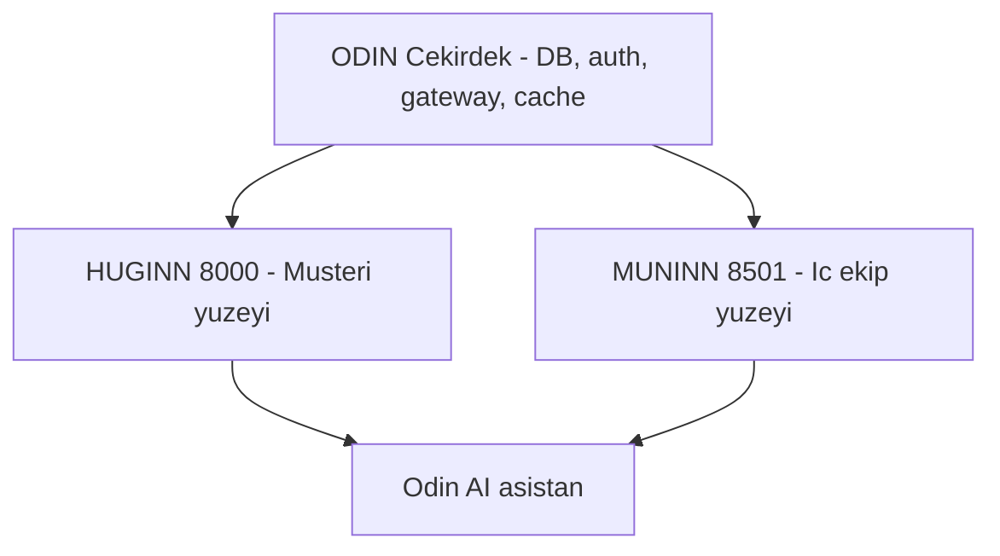

# Ürün Yüzeyleri ve Menü Ağacı (Sitemap) — V10

Bağlantılar: [[00-Home]] · [[13_po_karar_analizi]] · [[TODO]] · [[CHANGELOG]]
İlgili plan: `plans/MRK_marka_ve_dil_paketi_plani.md`

> **Amaç:** 20 admin + 3 müşteri ekranını, onaylı marka konumlandırmasına (Huginn / Muninn / Odin) göre iki ayrı ürün yüzeyine ve hiyerarşik menü ağacına oturtmak.
> **Durum:** Kanonik. Bu belge navigasyon konusunda tek doğru kaynaktır (SSOT).

---

## 0. Bu Belgenin Kapsam Devralması

Bu belge, `ADMIN-DOC-01` görevinin çıktısını devralır ve düzeltir.

| Sorun | Önceki durum | Bu belgedeki çözüm |
|---|---|---|
| Yanlış klasör | `AI projet v1/V10/15_...` (vault **dışında**, yazım hatası) | Doğru vault: `AI proje v1/V10/14_...` |
| Marka yok | "Admin Paneli" / "Müşteri Paneli" | Muninn / Huginn ayrımı uygulandı |
| Yüzey karışması | Müşteri sekmeleri admin ağacında | Müşteri sekmeleri **Huginn**'e taşındı |
| Eksik grup | "Güvenlik" rol akışında var, ağaçta yok | 🛡️ Güvenlik ve Denetim grubu eklendi |
| Eksik belge | `16_admin_panel_uygulama.md` hiç oluşmamış | Uygulama sırası Bölüm 6'da |
| Biçim | Bozuk ayraç/kaçış, ağaçlar kod bloğunda değil | Yeniden yazıldı |

> ⚠️ `AI projet v1/` (yazım hatalı) klasörü **geçersizdir**; vault dışında kaldığı için Obsidian graph'a ve submodule geçmişine girmez. Kilitleri düşürülüp klasör kaldırılmalıdır (bkz. Bölüm 7).

---

## 1. Yüzey Ayrımı — Hangi Kuzgun Neyi Taşır

| Yüzey | Port | Teknoloji | Marka | Kitle | Soru |
|---|---|---|---|---|---|
| Kullanıcı Paneli | 8000 | HTML/CSS/JS | **HUGINN** 🦅 | Ödeme yapan müşteri | "Ne oluyor?" |
| Admin Paneli | 8501 | Streamlit | **MUNINN** 🛡️ | İç ekip | "Ne oldu, neden?" |
| Çekirdek | — | `src/company_master/*` | **ODIN** ⚡ | Görünmez | "Neyin üstünde duruyor?" |

**Ayrım kuralı:** Bir ekran *müşterinin kendi verisine bakmasını* sağlıyorsa Huginn'dedir. *Sistemin kendisine* bakmasını sağlıyorsa Muninn'dedir. Tereddütte kalınırsa soru şudur: "Müşteri bunu görünce güven mi duyar, korkar mı?" Korkarsa Muninn.



---

## 2. Navigasyon Dil Kuralı (Onaylı Katman Ayrımının Uygulaması)

| Yüzey öğesi | Katman | Ton | Örnek |
|---|---|---|---|
| Menü etiketi | `veri` | Kuru, aranabilir | "Performans" |
| Sayfa H1 | `cerceve` | Mitolojik dokunuş | "Odin Çekirdeği — Performans" |
| Giriş paragrafı | `cerceve` | Anlatısal, çırak/usta | "Huginn dokuz diyarı tarıyor…" |
| Metrik değeri, hata kodu | `veri` | Mitolojisiz | "503 — bağlantı kesildi" |

**Gerekçe:** Menüde arama yapılır. "Odin'in Tahtı" yazan bir menüde kullanıcı "performans" aradığında hiçbir şey bulamaz. Mitoloji navigasyonun üstüne değil, **içine** girer.

---

## 3. MUNINN — Admin Paneli Menü Ağacı (8501)

6 üst grup, 20 ekran. Her satırdaki `menu_*` değeri `ui.json` anahtarıdır.

```
🏠 Genel Bakış                         menu_genel_bakis
├── KPI Özeti                          menu_kpi            (admin_kpi)
├── Sistem Sağlığı                     menu_saglik         (admin_performance — özet)
├── Canlı Durum                        menu_canli          (admin_realtime — özet)
└── Hata Bildirimleri                  menu_hatalar        (admin_errors)

👥 Müşteri ve Kullanıcı                 menu_musteri_grup
├── Müşteri Listesi                    menu_musteriler     (admin_musteriler)
├── Kullanıcı Yönetimi                 menu_kullanicilar   (admin_extras)
└── Karar Defteri                      menu_karar_defteri  (admin_panel)

📊 Veri ve Kalite                       menu_veri_grup
├── Kalite Skoru                       menu_kalite         (admin_quality)
├── Canlı Veri Akışı                   menu_realtime       (admin_realtime)
├── Global Arama                       menu_arama          (admin_search)
└── Veri Dışa Aktarma                  menu_export         (admin_export)

🔧 Sistem ve Altyapı                    menu_sistem_grup
├── Maliyet                            menu_maliyet        (admin_cost)
├── Performans                         menu_performans     (admin_performance)
├── API Analitiği                      menu_api            (admin_api_analytics)
├── Webhook İzleme                     menu_webhook        (webhook_monitor)
├── Kuyruk Hataları (DLQ)              menu_dlq            (admin_dlq)
└── Otomatik Yenileme                  menu_yenileme       (admin_auto_refresh)

🛡️ Güvenlik ve Denetim                  menu_guvenlik_grup
├── Denetim Kaydı                      menu_denetim        (admin_audit)
└── Kimlik ve Yetki                    menu_kimlik         (admin_auth)

⚙️ Ayarlar ve Geliştirici               menu_ayar_grup
├── Kullanıcı Ayarları                 menu_ayarlar        (admin_panel)
├── Yükleme Durumları                  menu_loading        (admin_loading)
├── Yönetim (bileşik)                  menu_yonetim        (admin_yonetim)
└── Sistem (bileşik)                   menu_sistem_bilesik (admin_sistem)
```

**Not — bileşik ekranlar:** `admin_yonetim` ve `admin_sistem`, alt panelleri zaten kendi içinde toplayan kapsayıcılardır. `st.navigation` alt sayfalara bölündüğünde bu ikisi **kaldırılacak** (içerikleri ilgili gruplara dağılır). Şimdilik "Geliştirici" altında kalır. Bkz. Bölüm 6, Adım 3.

**Marka sayfa başlıkları (H1 — `cerceve` katmanı):**

| Grup | H1 üst etiketi |
|---|---|
| Genel Bakış | Odin'in Tahtı |
| Müşteri ve Kullanıcı | Muninn'in Defteri |
| Veri ve Kalite | Huginn'in Gözü |
| Sistem ve Altyapı | Odin Çekirdeği |
| Güvenlik ve Denetim | Muninn'in Hafızası |
| Ayarlar | Bifröst Ayarları |

---

## 4. HUGINN — Kullanıcı Paneli Menü Ağacı (8000)

Mevcut `web_dashboard/index.html` bölümlerinin menü karşılığı. Görsel tasarım ayrı tura ertelendi; bu ağaç **bilgi mimarisidir**.

```
🏠 Ana Kontrol                          menu_h_ana          (ana_kontrol)
├── Müşteri Metrikleri
├── Sistem Metrikleri
└── Hızlı Eylemler

🔎 Firma Keşfi                          menu_h_kesif
├── Firma Arama                        menu_h_arama        (#companies-section)
├── Eşleştirme                         menu_h_eslestirme   (#match-section)
├── Sinyal Panosu                      menu_h_sinyal       (#signal-dashboard-section)
├── Sektör Dağılımı (NACE)             menu_h_nace         (#nace-section)
└── Veri Sağlığı                       menu_h_saglik       (#data-health)

📦 Paketler                             menu_h_paketler     (paketler)
├── Aktif Paket
├── Fiyat Karşılaştırma
└── Yükseltme

📢 Pazarlama                            menu_h_pazarlama    (pazarlama)
├── Kampanyalar
├── Segment Önerileri
└── Fırsatlar

💬 Odin AI                              menu_h_ai           (AI-CHAT-01 — ayrı görev)
```

⚠️ **Taşıma kararı:** `ana_kontrol`, `paketler`, `pazarlama` bugün Streamlit (8501) altında çalışıyor. Bunlar **müşteri ekranıdır**, hedefleri Huginn/8000'dir. Taşıma kademelidir; geçiş süresince Streamlit'te "Müşteri Önizleme" etiketiyle kalırlar, iç ekip müşterinin gördüğünü doğrulayabilsin diye. Ayrı görev: **MIG-UI-01**.

> **MIG-UI-01 durum (2026-09-15, ROO) — Aşama 1 tamamlandı:** `TabTanimi.yuzey` alanı eklendi (`muninn` varsayılan / `huginn`); üç bölüm `YUZEY_HUGINN` işaretli; `app.py::render_icerik` bu bölümlerde "👁 Müşteri Önizleme" şeridi basıyor. **Aşama 2 (tam göç → `web_dashboard/index.html`) bekliyor:** Huginn HTML'de paketler/pazarlama bölümü yok; "Huginn tasarım turu" tamamlanmadan göç açılmaz.

---

## 5. Rol Bazlı Görünürlük

| Rol | Yüzey | Görünen gruplar |
|---|---|---|
| Müşteri | Huginn | Tümü (kendi verisi) |
| Operasyon | Muninn | Genel Bakış, Müşteri, Veri |
| Veri Mühendisi | Muninn | Genel Bakış, Veri, Sistem |
| Geliştirici | Muninn | Sistem, Güvenlik, Ayarlar |
| Sistem Yöneticisi | Muninn | Tümü |
| Ürün Sahibi | Her ikisi | Tümü |

**Kural:** Yetkisiz ekran **gizlenir**, pasif gösterilmez. Gerekçe: pasif menü öğesi, var olmayan bir yetkiyi ima ederek destek talebi üretir.

---

## 6. Uygulama Sırası

| # | Adım | Bağımlılık | Görev |
|---|---|---|---|
| 1 | `ui.json` menü anahtarları (`menu_*`) | i18n paketi | MRK-02d |
| 2 | `SECTIONS` içindeki sabit Türkçe metinler → `t()` çağrısı | Adım 1 | U-09 |
| 3 | `st.navigation` + `st.Page` ile 6 grup / alt sayfa | Adım 2 | U-03 |
| 4 | Emoji → Material Symbols | Adım 3 | U-06 |
| 5 | Rol bazlı gizleme | Adım 3 | U-10 |
| 6 | Bileşik ekranların (`admin_yonetim`, `admin_sistem`) dağıtılması | Adım 3 | U-11 |
| 7 | Müşteri sekmelerinin Huginn'e göçü | Huginn tasarım turu | MIG-UI-01 |

**Kritik sıra kuralı:** Adım 1 ve 2 **önce** yapılır. `st.navigation`'a geçildikten sonra etiketleri i18n'e taşımak, 23 ekranın ve `test_dashboard_nav.py` testlerinin ikinci kez yazılması demektir.

---

## 7. Temizlik Borcu

| İş | Açıklama |
|---|---|
| Kilit düşürme | `AI projet v1/V10/15_admin_panel_sitemap.md` ve `16_admin_panel_uygulama.md` kilitleri `kilo` üzerinde açık; `lock_birak` ile bırakılmalı |
| Klasör kaldırma | `AI projet v1/` (yazım hatalı) kaldırılır; içerik bu belgeye devredildi |
| Görev kapama | `ADMIN-DOC-01` → bu belge ile karşılandı, `done` |
| Numara çakışması | `USER-DOC-01` `16_user_panel_sitemap.md` yazıyordu; Bölüm 4 bu ihtiyacı karşılar, görev kapatılabilir |

---

*Son güncelleme: 2026-09-14 · Kanonik belge: `AI proje v1/V10/14_urun_yuzeyleri_sitemap.md`*

---

## Ilgili Nodlar

- [[Huginn Data Insights/hubs/ADMIN_DASHBOARD_HUB]]
