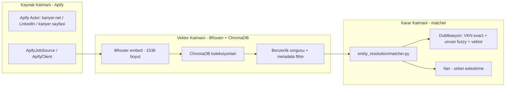

# 9Router Semantik Katman Mimarisi (9R-02/9R-03/9R-04)

> **Durum:** Taslak v1 — kullanıcı onayı bekliyor
> **Tarih:** 2026-09-11
> **İlgili V9 bölümleri:** `3.3 ChromaDB Vector Architecture`, `8.3 Global Deduplication`

---

## 1. Amaç

9Router AI Gateway entegrasyonunu (9R-01, tamamlandı) gerçek iş değerine dönüştüren **semantik katmanı** kurmak. Bu katman; firma verisi, iş ilanı ve kariyer sayfası metinlerini vektöre çevirip (9Router), saklayıp (ChromaDB) ve benzerlik/eşleştirme kararları üretir (matcher). Apify mevcut **kaynak (veri toplama)** katmanıdır — değişmez.

## 2. Mevcut Durum (Doğrulandı)

| Katman | Bileşen | Durum |
|---|---|---|
| Kaynak | ApifyClient + ApifyJobSource | ✅ Hazır (`job_intelligence/sources/`) |
| Kaynak | source_registry + MCP PolicyEngine | ✅ Hazır (`engine/source_registry.py`, `mcp/`) |
| Vektör üretim | 9Router `embed()` | ✅ Hazır (`gateway/ninerouter_client.py`, 1536-boyut) |
| Vektör saklama | **ChromaDB** | ❌ **Kurulu değil** (requirements'ta yok, V9 3.3 boş) |
| Eşleştirme | `entity_resolution/matcher.py` | ❌ **İskelet** (`NotImplementedError`) |
| Arama | `search/engine.py` (trigram) | ✅ Çalışıyor (semantik değil) |
| Chat | 9Router `chat()` | ✅ Hazır (`kimi-k2.7-code`) |
| Web | 9Router web_fetch/web_search | ⏳ Dashboard provider bekliyor (Firecrawl/Tavily) |

**Kritik boşluklar:** ChromaDB yok + matcher boş. Bu iki boşluk bu planın 9R-02 çekirdeğidir.

**Aktif görevler (panoda):** P7-15 (kilo, Signal Dashboard), GIT-01 (cline, git temizlik) — dosya çakışması yok.

## 3. Hedef Mimari



### Katman Sorumlulukları (tek iş per katman)

1. **Apify (kaynak):** anti-bot sitelerden ham ilan/firma metni toplar. Zaten yerinde, dokunulmaz.
2. **9Router embed (vektörleştirme):** metni 1536-boyut vektöre çevirir. `ninerouter_client.embed()` hazır.
3. **ChromaDB (saklama):** vektörleri + metadata (firm_id, nace_code, osb_region, verification_status) saklar; cosine benzerlik + metadata filtreli sorgu yapar. **Kurulacak.**
4. **matcher (karar):** VKN exact → unvan fuzzy (rapidfuzz) → vektör benzerliği üçlü skor; dublikasyon + ilan↔şirket eşleştirme kararı. **Doldurulacak.**

## 4. Modül Yapısı (Önerilen Yeni Dosyalar)

```
src/company_master/vector/            # YENİ paket
├── __init__.py
├── store.py          # EmbeddedVectorStore: ChromaDB'ye yaz/oku/sil
├── embedder.py       # NineRouter.embed() sarmalayıcı + batch + retry
└── service.py        # yüksek seviye: firmayı vektörle, sorgula, eşleştir

entity_resolution/matcher.py          # GÜNCELLENEcek: NotImplementedError kaldır
tests/vector/test_store.py           # YENİ testler (tmp/izinli, izole)
tests/vector/test_embedder.py
tests/vector/test_service.py
scripts/index_companies.py           # YENİ: firms.jsonl -> embed -> ChromaDB toplu indeks
docs/9ROUTER_SEMANTIK_KATMAN_MIMARISI.md  # BU rapor
```

## 5. Görev Kırılımı (Panoya İşlenecek)

### 9R-02 — Vektör Katmanı + Dublikasyon Pilotu (P1)
- ChromaDB'yi requirements'a ekle (`chromadb>=0.5.0`) + kurulum
- `vector/` paketi: `EmbeddedVectorStore` + `Embedder` + `Service`
- `scripts/index_companies.py`: `data/ostim/firmalar_*.jsonl` → embed → ChromaDB koleksiyon `companies`
- `entity_resolution/matcher.py`: VKN exact + rapidfuzz unvan + vektör benzerliği → `MatchResult`
- **Pilot çıktı:** OSTIM mevcut verisinde "aynı VKN'li 10 grup firma" (P7-15 notu) semantik skoru + rapor
- Test: izole (tmp_path), gerçek pano/veriye dokunmaz (DUPLICATE-TEST dersi)

### 9R-03 — Chat Tabanlı İlan Zenginleştirme (P2)
- `job_intelligence/pipeline/analyzer.py`'ye 9Router `chat()` ile sektör/pozisyon/skill çıkarımı ekle
- Apify pilot JSONL (`data/job_intelligence/apify_run-*.jsonl`) üzerinde örnek özet çıktı
- API fallback: 9Router yoksa mevcut regex tabanlı skorlayıcı korunur

### 9R-04 — Web Fetch/Search Aktivasyonu (P3, Dashboard provider şart)
- 9Router Dashboard'da Firecrawl (fetch) + Tavily (search) provider'ları eklendikten sonra
- `ninerouter_client.web_fetch/web_search` **canlı** entegrasyon testi
- Kariyer sayfası canlı analiz akışı (URL → markdown → `chat()` özet)

## 6. Bağımlılıklar ve Riskler

| Risk | Önlem |
|---|---|
| ChromaDB ağır bağımlılık | Lazy import; yoksa matcher yalnız VKN+fuzzy çalışır |
| Vektör boyut uyumsuzluğu | Sabit model: `openrouter/openai/text-embedding-3-small` (1536) |
| Pano çakışması | 9R-02/03/04 dosyaları aktif görevlerle (P7-15, GIT-01) çakışmıyor; kilitle önce kontrol |
| Test kirliliği | Tüm yeni testler `tmp_path` izole + gerçek task_board'a dokunmaz |
| VPN kaynaklı embed timeout | `embed()` retry sarmalayıcı; hata mesajında VPN notu |

## 7. Kabul Kriterleri (Definition of Done)

1. `vector/store.py` sola/sağa kosines benzerlik sorgusu testi geçer
2. `matcher.match()` `NotImplementedError` atmaz; VKN exact + fuzzy + vektör üçlü skor döner
3. `scripts/index_companies.py` OSTIM verisiyle çalışır, ChromaDB koleksiyonunda kayıt sayısı ≥ veri satırı
4. Aynı VKN'li firma grupları semantik benzerlik skoruyla raporlanır (P7-15 notuyla bağlantılı)
5. 53+ mevcut test kırmadan yeni testler geçer; pano kirlenmez

---

*Not: Bu rapor kalıcı mimari doküman olarak `docs/` altında tutulur; görev panosu kayıpları (9R-02/03/04) bu dosyaya referans verir.*