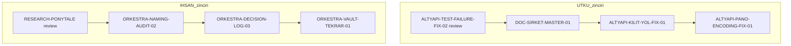

# Gece Zinciri Sprint Planı — 2026-09-22

Kaynak: `Huginn Data Insights/data/orchestrator/task_board.json` (5951 satır, tam tarama)
Hedef: UTKU 4 + İHSAN 4 görev, gece boyunca insan müdahalesiz zincir akışı.

## 1. Seçilen görevler

### UTKU (üretim, kanonik ad `utku`, araç kilo)

| # | task_id | P | Durum | Kaynak |
|---|---------|---|-------|--------|
| 1 | `ALTYAPI-TEST-FAILURE-FIX-02` | P1 | review | Mevcut — teslim edilmiş, onay bekliyor |
| 2 | `DOC-SIRKET-MASTER-01` | P1 | plan | Mevcut — brief referansı var |
| 3 | `ALTYAPI-KILIT-YOL-FIX-01` | P1 | YENİ | `DOC-V10-AUDIT-01` bulgusu: file_locks.json stale path |
| 4 | `ALTYAPI-PANO-ENCODING-FIX-01` | P1 | YENİ | `DOC-V10-AUDIT-01` bulgusu: pano başlıklarında mojibake |

Yeni 2 görev icat değil; `DOC-V10-AUDIT-01` teslim notundaki "3 görev açılmalı" maddesinin kapanmamış kalanı.

### İHSAN (orkestratör, kanonik ad `ihsan`, araç roo)

| # | task_id | P | Durum | Not |
|---|---------|---|-------|-----|
| 1 | `RESEARCH-PONYTALE` | P0 | review | Teslim edilmiş, elle onay şart (S-07) |
| 2 | `ORKESTRA-NAMING-AUDIT-02` | P1 | plan | Zincir 2/3, öncesi `DOC-V10-AUDIT-01` done |
| 3 | `ORKESTRA-DECISION-LOG-03` | P1 | plan | Zincir 3/3 |
| 4 | `ORKESTRA-VAULT-TEKRAR-01` | P2 | plan | Tek başına, oto onaya uygun |

## 2. Zincir tasarımı

İHSAN zinciri panoda zaten kısmen kurulu (`DOC-V10-AUDIT-01 → ORKESTRA-NAMING-AUDIT-02 → ORKESTRA-DECISION-LOG-03`). Kuyruğa 4. halka eklenir.

Sıra gerekçesi:
- UTKU: kilit yolu düzeltmesi encoding görevinden önce gelmeli, çünkü encoding görevi panoya toplu yazım yapacak ve kilit mekanizması sağlam olmalı.
- İHSAN: naming audit panoyu okur, decision-log düzeltmesi onun bulgusunu tüketir, vault taraması bağımsız kuyruk sonu.

### Dosya kilidi çakışma riski

`ORKESTRA-NAMING-AUDIT-02` ve `ALTYAPI-PANO-ENCODING-FIX-01` ikisi de `data/orchestrator/task_board.json` dosyasına dokunuyor. İki zincir paralel koştuğu için kilit çakışması olur. Çözüm: encoding görevi UTKU zincirinin **son** halkası, naming audit İHSAN zincirinin **ikinci** halkası — encoding görevine `blokaj: ["ORKESTRA-NAMING-AUDIT-02"]` konur, audit bitmeden başlamaz.

## 3. Zincir mekanizması — nasıl çalışıyor

Kod okumasından doğrulanan akış:

1. `trigger.teslim_et()` (satır 280) teslim anında `zincir_devam_et()` çağırır → **sonraki görev onay beklemeden tetiklenir**.
2. `trigger.onayla()` (satır 374) ikinci kez `zincir_devam_et()` çağırır → idempotent, çift tetik `tetik_ekle` tarafından engellenir (satır 150).
3. `oto_nobetci.nobetci_tur()` her 60 sn: onay kuyruğunu tarar, `otomatik_onaylanabilir()` ile filtreler, sonra tetik dosyasındaki `teslim` kayıtları için zinciri ilerletir.

Sonuç: **zincir akışı için oto_nobetci.py'de kod değişikliği gerekmiyor.** Sadece panodaki `zincir` alanları doğru kurulmalı.

## 4. Açık karar — S-07 engeli

`trigger.py:389` → `ELLE_ONAY_ONCELIKLERI = {"P0","P1"}`. Seçilen 8 görevin 7'si P0/P1.

Etki: gece boyunca görevler akar ve teslim edilir, ama **hiçbiri `done` olmaz**; onay kuyruğunda birikir. Sabah 7 elle onay gerekir.

Seçenekler:

| Seçenek | Ne yapar | Risk |
|---------|----------|------|
| A — Olduğu gibi bırak | Zincir akar, sabah toplu onay verilir | Sıfır risk. "Müdahale sıfır" hedefi %90 karşılanır |
| B — Görevlere `otomatik_onay: true` alanı | `teslim_et()` satır 264 bu alanı okuyup anında onaylar | S-07 kuralını görev bazında deler; denetim izi `isbirligi_raporu.jsonl`'a yazılır |
| C — Öncelikleri P2'ye düşür | Oto onay açılır | Kural kaçağı, önceliği yalanlar. Önermiyorum |
| D — S-07'yi kaldır | Tüm sistemde oto onay | Sahip kararını geri alır. Önermiyorum |

Önerim: **A**. Zincir zaten akıyor, onay sadece bir mühür. Gece boyunca 8 görev ilerler, sabah tek oturumda onaylanır.

## 5. Brief yolu

İstenen: `docs/plans/<TASK-ID>_brief.md`
Projede yerleşik: `data/orchestrator/<TASK-ID>_brif_<tarih>_<rol>.md` (D-55: rol son eki, ajan adı değil)

`gorev_kutusu.py al` komutu `talimat` alanı boşsa görevi aldırmaz (satır 92). Talimat alanına brief yolu yazılır.

Önerim: yerleşik kalıba uy. Aksi halde `ORKESTRA-NAMING-AUDIT-02` görevi kendi denetiminde bu 8 yeni dosyayı D-55 ihlali olarak raporlar.

## 6. Uygulama adımları (Code modu)

1. 2 yeni görevi panoya ekle:
   `python scripts/gorev_at.py at --task-id ALTYAPI-KILIT-YOL-FIX-01 --ajan utku --oncelik P1 --baslik "..." --dosya "..." --talimat "<brief yolu>"`
2. Aynısı `ALTYAPI-PANO-ENCODING-FIX-01` için, `blokaj` alanıyla.
3. 8 brief dosyasını yaz (UTF-8, mojibake yok).
4. Mevcut 6 göreve `talimat` alanını `gorev_at.py guncelle` ile yaz.
5. `zincir` alanlarını kur (sira/toplam/onceki/sonraki) — pano doğrudan düzenleme veya `duzen.pano_bakim()`.
6. Her iki zincirin baş halkasına tetik düşür: `trigger.tetik_ekle`.
7. `python scripts/gorev_kutusu.py basla --ajan utku` ve `--ajan ihsan` ile zincir çıktısını doğrula.
8. `AGENT_SYNC.md` + `gorev_panosu.md` otomatik üretimini çalıştır (elle yazma yasak).
9. `python scripts/oto_nobetci.py` tek tur — hata var mı bak.
10. `python scripts/oto_nobetci.py --surekli --aralik 60` gece boyunca.

## 7. Doğrulama kapısı

- `python -c "import json; t=json.load(open('data/orchestrator/task_board.json')); print(len(t))"` — pano bozulmadı mı
- `python scripts/gorev_kutusu.py bak --ajan utku` — talimat görünüyor mu, "TALIMAT YOK" uyarısı yok mu
- `python scripts/kodlama_denetim.py` — temiz mi
- Kuru tetik testi: ilk görevi `al` → `teslim` → sonraki tetiklendi mi
