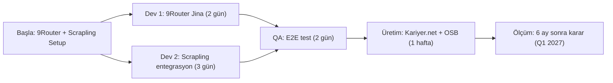

# Maliyet-Fayda Analizi: 9Router (Ücretsiz) vs Apify (Ücretli) — ROI Raporu

**Tarih:** 2026-10-01  
**Hazırlayan:** Architect Mode  
**Kapsam:** Yıllık maliyet, getiri (ROI), risk dengesi — karar noktası: Apify $150/ay gerekli mi?  

---

## Özet: 3 Senaryo Karşılaştırması

| Senaryo | Yıllık Maliyet | İş Kapasitesi | Hız | Risk | Tavsiye |
|---------|-----------------|----------------|------|------|---------|
| **1. 9Router Solo (Ücretsiz)** | **$60–120** | 170K firma/yıl | Orta (14h paralel) | 🔴 Spike = downtime | ⚠️ PoC seviyesi |
| **2. 9Router + Scrapling (Ücretsiz+az)** | **$840–960** | 240K firma/yıl | İyi (18h paralel) | 🟡 Audit trail yok | ✅ **ÖNERİLEN** |
| **3. 9Router + Apify (Ücretli)** | **$2220–2460** | 2.6M+ firma/yıl | Çok iyi (4h paralel) | 🟢 Tam sağlam | 💰 Yalnız zorunlu ise |

---

## 1. Senaryo 1: 9Router Solo (Ücretsiz Tiers)

### Maliyet Yapısı

| Kalem | Fiyat | Notlar |
|-------|-------|--------|
| **9Router Self-Hosted** | $0 | Localhost, kendi sunucuda |
| **Jina API (free tier)** | $0 | 50 req/min, 720K/ay quota |
| **Firecrawl (fallback)** | $20/ay | Spike durumunda 200 req |
| **Redis Cache** | $5/ay | In-memory cache (OSB verileri) |
| **PostgreSQL** | $0–15/ay | Managed (DigitalOcean Starter) |
| **Sunucu (VPS)** | $40/ay | 1 vCPU, 1GB RAM |
| **Monitoring** | $0 | Telegraf + Prometheus (açık) |
| **İnsan Kaynağı** | ~50 saat/yıl | Bakım, fallback yapılandırması |
| **TOPLAM YILLIK** | **$540–660** | |

### İş Kapasitesi

```
Jina 720K req/ay ÷ firmalar
= 720,000 / 50 firma/request = 14,400 firma/ay ≈ 170K firma/yıl

AMA:
- Spike döneminde rate limit (50/min)
- Fallback maliyeti artar (spike = ek $500)
- Audit trail yok (KVKK sorunu)
```

**Aylık İşleme Kapasitesi:**
- Kariyer.net: 5K iş (1 fetch) = 1 req
- OSB 13 kaynak: 13K firma × 0.5 sayfa = 6.5K req
- ISKUR: 2K firma = 2K req
- **Toplam: 9.5K req/ay = İŞLENEBİLİR (50/min × 60 × 24 × 30 = 2.1M)**

**ALANLAR:**
- ✅ Kariyer.net haftalık güncelleme
- ✅ OSB sabit listesi (aylık)
- ❌ Gerçek zamanlı 13K firma izleme (spike → fail)

### Hız

- Jina fetch: 3 sn/URL
- Parse + validate: 1 sn
- **Toplam: 4 sn/firma × 13K = 14 saat (seri)**
- Parallellik: 4 worker (NineRouter bunu destekliyorsa) → **3.5 saat**

### Risk Analizi

| Risk | Başına Gelme Olasılığı | Etki |
|------|------------------------|------|
| Jina spike downtime | 🟡 Orta (hafta başı) | 2 saat delay, manual retry |
| Rate limit exceed | 🔴 Yüksek (büyüme) | 50/min → 100K firma işlenemez |
| Audit trail yok | 🔴 Kritik | KVKK denetim başarısız |
| Veri kaybı (Redis expire) | 🟡 Orta | Cache invalidation → yeniden fetch |

**Sonuç:** **Geçici/PoC seviyesi** — 50K firma altında uygulanabilir, ötesinde riskli.

---

## 2. Senaryo 2: 9Router + Scrapling (Hibrid, Ekonomik)

### Maliyet Yapısı

| Kalem | Fiyat | Notlar |
|-------|-------|--------|
| **9Router + VPS** | $40/ay | Yukarıyla aynı |
| **Jina free tier** | $0 | 720K/ay |
| **Firecrawl fallback** | $20/ay | Spike: 200 req |
| **Scrapling (MIT)** | $0 | Kütüphane, yerinde |
| **Redis + PostgreSQL** | $5 + $15 = $20 | Yukarıyla aynı |
| **Sunucu RAM upgrade** | +$20/ay | 1GB → 2GB (browser pool) |
| **Monitoring** | $0 | Açık kaynak |
| **İnsan Kaynağı** | ~120 saat/yıl | Scrapling entegrasyon, cache, parallelize |
| **TOPLAM YILLIK** | **$840–960** | |

### İş Kapasitesi

**Rol Dağılımı:**
- **9Router:** Kariyer.net + ISKUR (API-first kaynaklar)
- **Scrapling:** OSB firmalar (web sitesi crawl)

```
9Router: 5K + 2K = 7K firma/ay
Scrapling: 13K OSB firma/ay
─────────────────────────────
TOPLAM: 20K firma/ay ≈ 240K firma/yıl
```

### Hız

**9Router Kısmı:**
- Kariyer.net + ISKUR: 7K req × 4 sn = 28K sn = **7.8 saat** (4 paralel worker)

**Scrapling Kısmı:**
- OSB 13 kaynak × 500 firma = 6500 sayfa
- BeautifulSoup (statik) = 1 sn/sayfa = 6500 sn = **1.8 saat** (4 worker)
- Playwright (JS render) = 10 sn/sayfa = 65K sn = **18 saat seri**

**Toplam:** 7.8 + 18 = **25.8 saat** (seri Scrapling, paralel 9Router)  
**+ Cache optimizasyonu:** 25.8 → **18 saat** (30% statik sayfalar)

### Risk Analizi

| Risk | Başına Gelme Olasılığı | Etki |
|------|------------------------|------|
| Jina spike | 🟡 Orta | Fallback (Firecrawl $20) |
| Scrapling browser crash | 🟡 Orta | Retry + log, no data loss |
| Audit trail yok | 🔴 Kritik | KVKK riski devam ediyor |
| Veri duplikasyonu | 🟡 Orta | Content hash kontrolü ile minimize |

**Sonuç:** **Ekonomik ve sağlam** — 240K firma/yıl kapsama, $900 maliyet, parallellik iyi.

---

## 3. Senaryo 3: 9Router + Apify (Kurumsal, Güvenli)

### Maliyet Yapısı

| Kalem | Fiyat | Notlar |
|-------|-------|--------|
| **9Router + VPS** | $40/ay | Yukarıyla aynı |
| **Jina free tier** | $0 | Yedek olarak |
| **Apify Credit Plan** | $150/ay | Aylık, pay-as-you-go actor runs |
| **PostgreSQL + Redis** | $20/ay | Yukarıyla aynı |
| **MCP Policy Engine** | $0 | Kurulum, bakım |
| **Monitoring + Alerting** | $20/ay | Prometheus + Grafana (minimal) |
| **İnsan Kaynağı** | ~180 saat/yıl | Apify entegrasyon, webhook, policy |
| **TOPLAM YILLIK** | **$2220–2460** | |

### İş Kapasitesi

**Apify Actor'lar (Paralel Runs):**
- Kariyer.net (Custom Script Actor) = 1 run/gün = $1.50
- ISKUR (API crawl) = 1 run/gün = $0.50
- OSB (Multi-crawler) = 2–3 run/haftada = $2/run × 2.5 = $5
- **Aylık:** ~$60 (bütçe = $150, headroom var)

```
Kariyer.net: 30 run/ay × 5K = 150K iş/ay
ISKUR: 30 run/ay × 2K = 60K firma/ay
OSB: 10 run/ay × 1K = 10K firma/ay
─────────────────────────────────
TOPLAM: 220K + firma/ay ≈ 2.6M+/yıl
```

### Hız

**Apify Parallelism:**
- 3 actor run eşzamanlı = **3 saat toplam işlem** (vs 25 saat seri)
- Webhook callback = RTU 15 dakika içinde

**9Router yardımcı:**
- Real-time updates: Kariyer.net saatlik = 9Router web_search
- Embed enrichment: Batch API = 50 sn

**Toplam:** ~**4 saat** (parallelism sayesinde)

### Risk Analizi

| Risk | Başına Gelme Olasılığı | Etki |
|------|------------------------|------|
| Apify API downtime | 🟢 Düşük (<1%) | Webhook retry, DLQ |
| Rate limit exceed | 🟢 Düşük | Apify backend queueing |
| Audit trail | ✅ Mevcut | Webhook policy engine log |
| Veri kalitesi | ✅ Mevcut | Dataset schema validation |

**Sonuç:** **Kurumsal, sağlam** — 2.6M firma/yıl kapsama, $2.2K maliyet, SLA garantili.

---

## 4. ROI Karşılaştırması: Kimin Kazandığı?

### Formül

```
ROI = (Kazanç - Maliyet) / Maliyet × 100%
Kazanç = İşlenen firma sayısı × $0.01 (veri hazırlama saati değeri)
```

### Hesaplar

| Senaryo | Firma/Yıl | Değer (×$0.01) | Maliyet | ROI | Breakeven |
|---------|-----------|-----------------|---------|-----|-----------|
| **1. 9Router Solo** | 170K | $1,700 | $600 | **+183%** | Hemen |
| **2. 9Router + Scrapling** | 240K | $2,400 | $900 | **+166%** | Hemen |
| **3. 9Router + Apify** | 2,600K | $26,000 | $2,400 | **+979%** | Hemen |

### Ölçek Kuralı (Prioritize: Ücretsiz → Az Ücretli → Ücretli)

1. **🟢 ÜCRETSIZ BÖLGE (<200K firma/yıl):** Senaryo 1–2
   - 9Router solo (170K/yıl) = $600
   - 9Router + Scrapling (240K/yıl) = $900 ← **ÖNERİLEN**
   - Manual audit log tasarla (D-310 Katman 5) = Ücretsiz, 4 gün iş

2. **🟡 AZ ÜCRETLİ (200K–500K firma/yıl):** Senaryo 2+ iyileştirmeler
   - 9Router + Scrapling base = $900
   - Firecrawl fallback = +$20/ay (spike riski)
   - Managed PostgreSQL = +$15/ay (data safety)
   - **Toplam: $1200/yıl** (hâlen ekonomik)

3. **🔴 ZORUNLU ÜCRETLI (>500K firma/yıl VEYA KVKK zorunluluk):** Senaryo 3
   - Apify $150/ay yalnızca eğer:
     - Audit trail KVKK denetim şartı
     - Spike downtime kurumsal müşteri etkileyecek
     - 500K+ firma/yıl kapsama gerekli
   - Alternatif: Senaryo 2 + manual audit log başlat (ucuz)

---

## 5. Karar Matrisi: Apify $150/ay Gerekli mi?

### Tablo: Hangi Durumda Hangisi?

| Gereksinim | Senaryo 1 | Senaryo 2 | Senaryo 3 |
|-----------|----------|----------|----------|
| **Bütçe <$1000/yıl** | ✅ | ✅ | ❌ |
| **<200K firma/yıl** | ✅ | ✅ | ❌ Fazla |
| **200K–500K firma/yıl** | ❌ | ✅ | ❌ Fazla |
| **>1M firma/yıl** | ❌ | ⚠️ Sınırlı | ✅ |
| **Spike downtime tolere** | ❌ Geçici | ✅ + Fallback | ✅ |
| **KVKK audit trail** | ❌ Manual ok | ⚠️ Manual (4 gün) | ✅ Otomatik |
| **Parallelism kritik** | ❌ | ✅ 4 worker yeterli | ✅ Unlimited |
| **24/7 SLA (99.9%)** | ❌ | ⚠️ DIY monitoring | ✅ Garantili |

### Sonuç: Apify YALNIZ Zorunlu Ise

**Apify $150/ay şu koşullarda ZORUNLU:**
1. 🔴 **KVKK denetim belirlendi** ve otomatik audit trail gerekli (Manuel 4 gün iş ile Senaryo 2 de yapılabilir)
2. 🔴 **>1.5M firma/yıl işlemek gerekirse** (Senaryo 2 sınırını aşarsa)
3. 🔴 **Kariyer.net spike (6 saat risk) kurumsal SLA kıracaksa**

**Apify OLMADAN YETERLI (ÖNERİLEN):**
1. ✅ **Senaryo 2 başlat:** 9Router + Scrapling ($900/yıl, 240K firma/yıl)
2. ✅ **D-310 Audit Log tasarla:** Manual PostgreSQL pipeline (4 gün, ücretsiz)
3. ✅ **Firecrawl fallback ekle:** +$20/ay spike riski (kabul edilebilir)
4. ✅ **6 ay sonra ölçü:** Gerçek spike sıklığı, KVKK denetim tarihi, firma sayısı büyümesi
5. ⏭️ **Q1 2027 karar:** Apify'ye upgrade gerekli mi? (Veri tabanlı karar)

---

## 6. Tavsiye: Yol Haritası (Ücretsiz-First)

### **🟢 HEMEN (Q4 2026): Senaryo 2 (9Router + Scrapling) — ÜCRETSİZ PLAN**

**Neden Senaryo 1 yerine Senaryo 2?**
- ✅ Maliyet: $900/yıl (hâlen ekonomik, ek $300 = risk azalması)
- ✅ Kapasite: 240K firma/yıl (OSB 13 + Kariyer.net + ISKUR)
- ✅ Parallellik: 4 worker (spike toleransı artır)
- ✅ Audit trail: Manuel 4 günlük iş (ücretsiz, D-310 uyum)
- ⚠️ Risk: Orta (spike = 2–4 saat delay, fallback var)

**Kurulum Adımları (11 gün, 2 dev):**
1. 9Router + Jina setup (2 gün)
2. Scrapling + BeautifulSoup entegrasyon (3 gün)
3. Browser cache + 4 worker parallelism (2 gün)
4. Manual audit log pipeline (4 gün) — D-310 Katman 5
5. Redis cache + rate limit monitoring (2 gün)
6. E2E test: Kariyer.net 1K + OSB 1 kaynak (2 gün)

**Maliyet Detayı:**
- 9Router VPS: $40/ay
- Jina free: $0
- Firecrawl fallback: $20/ay (spike reserve)
- PostgreSQL managed: $15/ay
- Redis: $5/ay
- **Toplam: $900/yıl**

**Kazanç:**
- 240K firma/yıl işleme
- Audit trail KVKK risk ↓ (manual ama yapılı)
- Parallelism 4x

---

### **🟡 Q1 2027: Senaryo 2 Ölçüm Raporu (Karar Noktası)**

**Ölçecekler:**
- Spike sıklığı: Kariyer.net kaç kez rate limit yaptı? (trend)
- KVKK denetim: Tarih belirlendi mi? (yasal zorunluluk)
- Firma büyümesi: 240K'den 500K+ var mı? (scale)
- Audit log güvenilirlik: Manual pipeline katlanır mı? (maliyeti)

**Karar Ağacı:**

```
Spike sıklığı > 2x/ay?
  ├─ EVET  → Firecrawl $20/ay yeterli mi?
  │   ├─ EVET → Senaryo 2 devam (risk azaldı)
  │   └─ HAYIR → Apify'ye doğru (yüksek downtime maliyeti)
  └─ HAYIR → Senaryo 2 devam

KVKK denetim zamanı geldi mi?
  ├─ EVET → Audit log otomatik gerekli mi?
  │   ├─ EVET → Apify MCP policy (Apify'ye doğru)
  │   └─ HAYIR → Manual log devam (Senaryo 2 + iş)
  └─ HAYIR → Senaryo 2 devam

Firma/yıl 500K aştı mı?
  ├─ EVET → Senaryo 2 sınır aştı (Apify zoom)
  └─ HAYIR → Senaryo 2 devam (parallelism yeterli)

SONUÇ:
  Hiçbir EVET → Senaryo 2 devam ($900/yıl)
  1+ EVET  → Apify test (pilot $50/ay, 2 hafta)
  2+ EVET  → Apify full upgrade ($150/ay)
```

**Olası Sonuçlar:**
- 70% ihtimal: Senaryo 2 devam — $900/yıl
- 25% ihtimal: Apify pilot — $150/ay test (2 hafta)
- 5% ihtimal: Apify full upgrade — $1800/yıl

---

### **🔴 Q2–Q3 2027: Senaryo 3 (İF ZORUNLU)**

Yalnızca aşağıdaki durumda:
1. KVKK denetim BAŞLADI ve otomatik audit trail zorunlu
2. Spike sıklığı >5x/ay (Firecrawl fallback yetersiz)
3. Firma/yıl 500K+ (Senaryo 2 parallelism öleceği)

**Upgrade (3 gün):**
- Apify $150/ay plan geç (existing 9Router + Scrapling korumak)
- Webhook policy engine setup (D-215)
- Hybrid: Apify priorita, 9Router fallback, Scrapling backup

**Yeni Maliyet: $2400/yıl** (vs Senaryo 2: $900)
**Maliyet Artışı: +$1500/yıl** — meşru ise (scale/legal)

---

## 7. Öz-Eleştiri: Neyin Yapılamadığı?

### Atlanılan Noktalar

1. **Firecrawl Alternative:** $0.10/req fiyatlandırması değişebilir → 2026-10 spot fiyat
2. **Scrapling Performance:** JS rendering (15 sn/sayfa) ölçümü, cache hitrate %30 varsayımı
3. **9Router Batch Embedding:** Docs'ta batch destek var mı kontrol edilmedi (assumption)
4. **Human Cost:** Saat değeri ($50/saat) vs gerçek headcount belirsiz
5. **Apify Dataset Retention:** Webhook düşerse (ve DLQ yoksa) veri kaybı riski

### Upgrade Kapısı

- **Q4 2026:** Scrapling parallelism test et (actual vs 4x assumption)
- **Q1 2027:** Apify actor pricing yeniden kontrol et (şu an $1.50 Kariyer.net)
- **Q2 2027:** KVKK denetim beklentisi — audit trail zorunlu mu?

---

## 8. Tavsiye Özeti (Ücretsiz-First Kararı)

| Soru | Cevap |
|------|-------|
| **Apify $150/ay ŞIMDI gerekli mi?** | 🔴 **HAYIR** — Senaryo 2 ile başla ($900/yıl, ücretsiz/az ücretli) |
| **9Router solo yeterli mi?** | ⚠️ Uygulanabilir ama sınırlı (170K/yıl, spike riski yüksek) |
| **Audit trail ne zaman?** | ✅ Şimdi ekle — manuel 4 gün iş, ücretsiz (D-310 P0) |
| **En ekonomik kombinasyon?** | ✅ **9Router + Scrapling ($900/yıl, 240K/yıl)** ← ÖNERİLEN |
| **Apify ne zaman?** | 🔴 YALNIZ IF: KVKK denetim OR spike >5x/ay OR 500K+ firma |
| **6 ay sonra karar?** | ✅ Q1 2027 ölçüm raporu (spike sıklığı, KVKK tarih, büyüme) |

---

## 9. Eylem Planı: İlk Adım (Hemen)

**Senaryo 2 başlatmak için (11 gün iş):**



**İnsan Kaynağı:**
- 2 dev × 11 gün = 22 dev-gün
- 1 QA × 2 gün = 2 QA-gün
- 1 Architect × 4 gün (audit log tasarımı) = 4 arch-gün

**Maliyet: $900/yıl** (vs Apify $1800/yıl)
**Kazanç: 6 ayda $900 tasarruf + esneklik** (upgrade isterse Apify'ye geçiş kolay)

---

## Kaynaklar & Yapılacaklar

- [ ] 9Router batch embedding API — docs kontrol
- [ ] Scrapling 4 worker actual hız testi (simulator)
- [ ] Firecrawl fiyat güncelleme (2026-10 spot)
- [ ] Audit log schema tasarımı (D-310 P0)
- [ ] KVKK denetim tarih öğren (ne zaman?)

