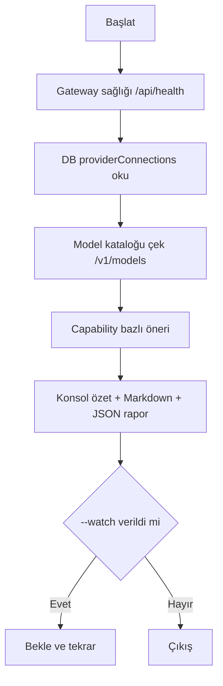

# 9R-05 Adım 1 — 9Router Durum İzleme (Monitor) Scripti Planı

> Tarih: 2026-09-12 (rev.2 — 31 kayıtlık yeni envanter keşfi sonrası güncelleme)
> Amaç: 9router'ın provider durumunu, model kataloğunu ve gateway sağlığını
> **tek komutla görünür** yapan kalıcı bir izleme scripti.
> Sonraki adımlar (akıllı yönlendirici) bu rapora dayanacak.

## 0. Keşif Bulguları (2026-09-12 11:57 — `_9r05_provider_inventory`)

- **DB'de 31 kayıt / 24 yeni benzersiz provider var** (firecrawl/tavily/ollama/openai dışında):
  antigravity, api-airforce, bazaarlink, claude, cline, clinepass, cloudflare-ai,
  gemini, gemini-cli, github, grok-cli, kilo-gateway, kimchi×2, kimi×4, kiro,
  nvidia, openrouter, perplexity, perplexity-agent, poolside, tokenrouter, xai×2.
- **Sağlık özeti:** ✅ aktif (16) | ⚠️ unavailable (4: cline 402, kimi pri1 401,
  ollama 502, tokenrouter 403) | ❌ error (8: api-airforce 402+backoff=14,
  bazaarlink, kilo-gateway, perplexity 403, perplexity-agent, poolside, xai pri1 403,
  xai pri2 402).
- **🚨 Canlı API 530 (Cloudflare tünel) hatası:** `/api/health`, `/v1/models*` yanıt
  vermedi → katalog/combo/free doğrulanamadı. Script bu durumu **ayrıca raporlamalı**.
- **Kritik adaylar:** api-airforce backoffLevel=14, tokenrouter 112 model kilitli,
  ollama hâlâ 502+kilitli, kimi 4 ayrı kayıt (pri 1-4; pri1 401).

## 1. Kapsam

**Hedef:** `scripts/9r_provider_health.py` — kalıcı script (geçici `_9r04_*` dosyalarından farklı; `_` prefix'i yok).

**Kapsam dışı (sonraki adımlar):**
- Akıllı yönlendirici (provider_router.py) — Adım 2
- Karar geçmişi (karar_gecmisi.jsonl) — Adım 3
- `embed()` varsayılan model değişimi — Adım 4

## 2. Akış



## 3. Yapacakları

### 3.1 Gateway Sağlığı
- `GET /api/health` → `{"ok": true}` mı?
- Hata → `GatewayUnavailable` yakala; **VPN notu** ekle (AGENTS.md kuralı).

### 3.2 Provider Durumu (DB — `providerConnections`)
Her provider için `data` JSON alanları:
| Alan | Anlam | Gösterim |
|------|-------|----------|
| `testStatus` | available / unavailable | ✅ / ⚠️ |
| `lastError` | son hata mesajı | sarı |
| `errorCode` | hata kodu (502 vb.) | kırmızı |
| `modelLock_*` | capability bazlı kilit (webfetch:ollama gibi) | 🔒 |
| `backoffLevel` | backoff seviyesi (0=normal) | 🔄 xN |
| `rateLimitedUntil` | rate-limit bitiş zamanı | ⏳ |
| `priority` | öncelik (1=tümü şu an) | sıralama |
| `isActive` / `updatedAt` | aktiflik / son güncelleme | gri |

**Güvenlik:** `data` içindeki secret'lar maskelenir (mevcut `_9r04_ollama_detay.py` deseni).

### 3.3 Model Kataloğu (Canlı API)
- `/v1/models/embedding` → embedding modelleri + boyut bilgisi
- `/v1/models/web` → web search/fetch provider'ları (`kind` alanı)
- `/v1/models` → chat modelleri
- `owned_by == "combo"` modelleri ayrı işaretle (otomatik fallback)
- **Free/pricing bilgisi:** API'de yoksa "bilgi yok" göster; config tabanlı free listesi Adım 2'de.

### 3.4 Capability Bazlı Öneri
Her capability (embed / fetch / search / chat) için:
- Kullanılabilir provider'lar (sağlıklı + aktif)
- En iyi aday önerisi (priority + free öncelik)

## 4. Kullanım

```bash
python scripts/9r_provider_health.py               # tek sefer
python scripts/9r_provider_health.py --watch 60    # her 60 sn yenile
python scripts/9r_provider_health.py --json        # sadece JSON çıktı (makine)
python scripts/9r_provider_health.py --db <yol>    # 9router DB yolu override
python scripts/9r_provider_health.py --katalog     # canlı /v1/models çağrısı da yap
```

- `--katalog` verilmezse **yalnız DB tabanlı** rapor üretir (ağ yok, her zaman çalışır).
- `--katalog` verilirse canlı API çağrıları yapılır; **530/tünel hatası ayrı bölümde**
  raporlanır ve rapor "kısmi" olarak işaretlenir (keşif bulgusu 0.).

## 5. Çıktılar

| Çıktı | Yer | Amaç |
|-------|-----|------|
| Konsol özeti | stdout | hızlı bakış (renkli: ✅/⚠️/🔒/❌) |
| Markdown rapor | `data/router/provider_durum_<tarih>.md` | insan okunabilir, panoya eklenir |
| JSON | `data/router/provider_durum_latest.json` | makine okunabilir (izleme/CI) |

## 6. Çıktı Örneği (Şablon)

```
9Router Sağlık Raporu — 2026-09-12 08:51
Gateway: ✅ OK (https://r3qmzpf.abc-tunnel.us)

Provider Durumu:
  firecrawl  | pri=1 | ✅ available
  tavily     | pri=1 | ✅ available
  ollama     | pri=1 | ⚠️ unavailable (502) — webFetch kilitli 🔒
  openai     | pri=? | ✅ available (embedding)

Model Kataloğu:
  embed: openai/text-embedding-3-small(1536) | gemini/text-embedding-004(768) | ...
  combo: embedding-combo? fetch-combo? search-combo?  (owned_by=combo)

Capability Önerisi:
  embedding → openai/text-embedding-3-small
  fetch     → firecrawl [combo: fetch-combo?]
  search    → tavily    [combo: search-combo?]
```

## 7. Teknik Notlar

- **DB yolu:** `C:\Users\yasin\AppData\Roaming\9router\db\data.sqlite` (varsayılan; `--db` ile override).
- **Env:** `NINEROUTER_URL` / `NINEROUTER_KEY` zaten `.env`'de → `ninerouter_client` ile canlı çağrılar.
- **Yeniden kullanım:** [`ninerouter_client.health()`](src/company_master/gateway/ninerouter_client.py:203), [`list_models(kind)`](src/company_master/gateway/ninerouter_client.py:211) ve keşif scripti [`_9r05_provider_inventory.py`](scripts/_9r05_provider_inventory.py:1) deseni (sekme bazlı veri okuma).
- **31 kayıt görünümü:** Çoklu hesap (kimi×4, kimchi×2, xai×2) aynı provider altında
  ayrı satırlarda gösterilir; sorunlu birincil hesap (pri1 401/403) açıkça işaretlenir.
- **VPN kuralı:** Ağ hatasında çıktıya "olası neden: VPN" notu eklenir.
- **UTF-8:** Türkçe karakterler korunur (bozulma kontrolü yapılır).

## 8. Doğrulama

1. Script **`--katalog` olmadan** tek sefer çalışır → 3 çıktı üretir (konsol + md + json); ağ gerektirmez.
2. `--katalog --watch 60` ile canlı API denenir; 530/tünel hatası "kısmi rapor" olarak düşer.
3. 31 kayıt: yeni provider'lar (antigravity, kiro, tokenrouter vb.) listelenir; sorunlular
   (api-airforce backoff=14, tokenrouter 112 kilit, ollama 502) ayrı "⚠️ Dikkat" bölümünde görünür.
4. Secret alanlar maskelenir (rapor içinde anahtar/token yok).
5. VPN'li/yol yok senaryosu hatasız mesaj üretir.