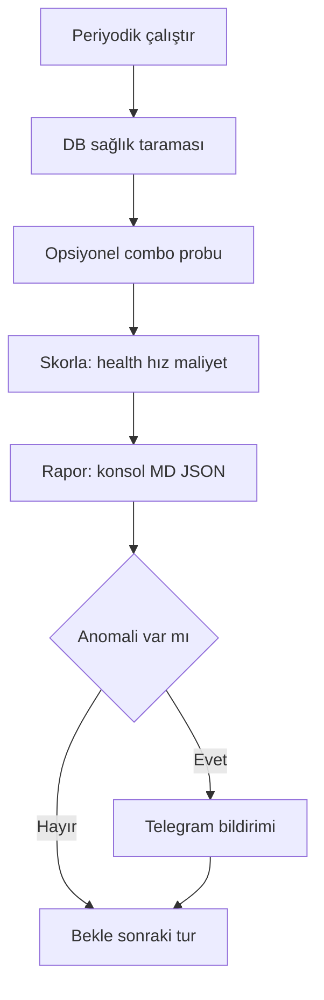

# 9R-05 — 9Router Optimizasyon & İzleme Aracı (Orta Düzey)

> Tarih: 2026-09-12 (rev.3 — 9router dokümanları okundu, combo/auto-fallback gerçeği eklendi)
> Amaç: 9router'ın kendi optimizasyonunu (combo modeller) **gözlemlemek**, ölçmek,
> maliyet/hız/health skorlamasıyla **öneri** üretmek ve periyodik izleme + bildirim yapmak.
> Sonraki aşama (akıllı yönlendirici) bu aracın rapor/karar geçmişini yönlendirici olarak kullanır.

## 1. Kritik Gerçek: 9router Zaten Optimize Ediyor

| Beklenti | Gerçek |
|----------|--------|
| Biz provider seçelim | Hayır — **`combo` modeller otomatik fallback** yapar: `fetch-combo`, `search-combo` |
| Seçilen provider bilinemez | Bilinir — yanıt `provider` alanı döner |
| Maliyet takip edilemez | Takip edilir — `usage.search_cost_usd`, `usage.fetch_cost_usd`, `usage.provider_credits_used` |
| Hız ölçülemez | Ölçülür — `metrics.response_time_ms`, `metrics.upstream_latency_ms` |

**Bu yüzden bizim işimiz:** combo'yu yönetmek **değil** — onu gözlemlemek, ölçmek,
anomalileri (provider kalıcı çöktü / maliyet sıçradı / kilit birikti) yakalayıp
**öneri + bildirim** üretmek.



## 2. Neler Yapar (Orta Düzey Kapsam)

### 2.1 Sağlık Taraması (her zaman, DB tabanlı, ağ gerektirmez)
- 31 kayıt default iken **tüm providerConnections** okunur: ad, priority, isActive,
  testStatus, lastError, errorCode, `modelLock_*` (capability kilidi), backoffLevel,
  rateLimitedUntil, updatedAt.
- Çoklu hesap (kimi×4, kimchi×2, xai×2) ayrı satır; **birincil (pri1) hesap sorunu** işaretlenir.
- Secret maskeli (keşif scripti deseni).

### 2.2 Combo Probu (opsiyonel, `--probe`, maliyet bilinçli)
Gerçek küçük çağrılarla combo davranışını ölç (her probe kayda değer değil; varsayılan frekans sınırlı):

```bash
# fetch-combo davranışı (hangi provider'a düştü, süresi, maliyeti)
POST /v1/web/fetch {model:"fetch-combo", url:"https://example.com", format:"text", max_characters:200}
# search-combo davranışı
POST /v1/search {model:"search-combo", query:"9Router", max_results:2}
# embedding probu denemesi (maliyet yoksa)
POST /v1/embeddings {model:"openai/text-embedding-3-small", input:["test"]}
```

Her prob sonucu bir satır (karar geçmişi):
`data/router/karar_gecmisi.jsonl` → `{ts, capability, secili_provider, sure_ms, maliyet_usd, basarili, hata}`

### 2.3 Skorlama & Öneri
Her capability (embed/fetch/search) için **kombine skor 0-100**:

| Bileşen | Ağırlık | Ölçüm |
|---------|---------|-------|
| Sağlık | %50 | testStatus + kilit + backoff cezaları |
| Hız | %25 | son prob `response_time_ms` ortalaması |
| Maliyet | %25 | son prob `*_cost_usd` (0 = ideal) |

Öneri çıktısı: `embedding → openai (skor 92)`, `fetch → firecrawl (skor 88)`,
`search → tavily (skor 85)` + combo model adı (Varsa).

### 2.4 Anomali Tespiti & Bildirim
| Anomali | Koşul | Aksiyon |
|---------|-------|---------|
| Provider çöktü | testStatus unavailable/error Δ | Telegram uyarısı (mevcut altyapı) |
| Kilit birikti | modelLock_* sayısı eşik → (örn. >10) | Telegram + raporda ⚠️ |
| Backoff tırmandı | backoffLevel ≥ 5 | Telegram + raporda 🔄 |
| Maliyet sıçradı | prob maliyeti ortalamanın 3× | Telegram + raporda 💰 |
| Gateway kapalı | /api/health yanıt yok (530 vb.) | "olası neden: VPN" notu + Telegram |

Bildirim = Telegram (TELEGRAM_BOT_TOKEN/CHAT_ID zaten `.env`'de); yoksa konsol uyarısı.

### 2.5 Veritabanı Yedekleme (periyodik, WAL-safe)

- **Gerçek yol (Windows):** `%APPDATA%\9router\db\data.sqlite`. Windows'ta 9router APPDATA kullanır; `~/.9router/` \*nix konvansiyonudur. `--db` ile bu yol zaten override edilebilir. `-wal`/`-shm` dosyaları aynı klasörde durur (uygulama açıkken).
- **Yöntem:** SQLite **backup API** (Python `sqlite3`) ile tutarlı anlık görüntü al. WAL modunda uygulama çalışırken ham dosya kopyalamak bozuk/eksik yedek üretir.
- **Hedef:** `data/router/yedekler/9router_<YYYYMMDD_HHMM>.sqlite`
- **Saklama:** son 7 yedeği tut; eskileri otomatik sil (`--backup-keep 7`).
- **Çalışma ağı:** tamamen yerel → VPN/tünel kapalıyken de çalışır. `--watch` modunda günde 1 kez (ilk tur + gün değişince); elle `--backup` ile istenince.
- **Taşınabilirlik:** yedek, ayarları taşımak içindir — sunucuya taşınınca 9router uygulaması açıkken aynı yedekten geri yüklenebilir veya sunucuda 9router kurulup ayarları bu yedekten import edilebilir (kullanıcı onayıyla).
- **KVKK:** yedekte token/anahtar olabilir → `data/router/yedekler/` `.gitignore`'a eklenir, dışarı (harici ajan vb.) gönderilmez.

## 3. Kullanım

```bash
python scripts/9router_optimizer.py                 # sağlık taraması + rapor (ağ yok)
python scripts/9router_optimizer.py --probe         # + combo probu (maliyetli, dikkatli)
python scripts/9router_optimizer.py --watch 3600    # periyodik (saatlik) izleme
python scripts/9router_optimizer.py --json          # sadece JSON (CI / scheduler)
python scripts/9router_optimizer.py --db <yol>      # 9router DB yolu override
python scripts/9router_optimizer.py --limit-probes 5  # bir turda max prob sayısı
```

Periyodik kullanım önerisi: Windows Görev Zamanlayıcı → saatlik `--probe --watch` veya
günde 1-2 kez tam tur; normal akışta `--probe`'suz.

## 4. Çıktılar

| Hedef | Yer |
|-------|-----|
| Konsol (renkli, 3 bölüm: Sağlık / Skor & Öneri / Uyarılar) | stdout |
| Markdown rapor | `data/router/optimizer_<tarih>.md` |
| JSON (makine) | `data/router/optimizer_latest.json` |
| Karar geçmişi (probe satırları) | `data/router/karar_gecmisi.jsonl` |
| Sentinel (anomali bayrakları) | `data/router/son_uyarilar.json` (tekrar engelleme için) |

## 5. Kapsam Dışı (Sonraki Aşama)

- `provider_router.py` — kararı otomatik uygulama (bu araç **öneri** üretir, uygulamaz).
- `embed()` / `web_fetch()` / `web_search()` içine alias entegrasyonu.
- Combo yapılandırmasını değiştirme (9router Dashboard işi).
- Pricing veritabanı (free öncelik config'i Adım 2'de).

## 6. Teknik Notlar

- **Kaynak desen:** [`_9r05_provider_inventory.py`](scripts/_arsiv/9r05/_9r05_provider_inventory.py:1) (DB oku, arşivlendi) +
  [`ninerouter_client`](src/company_master/gateway/ninerouter_client.py:59) (canlı çağrı, `.env` otomatik).
- **DB yolu:** `C:\Users\yasin\AppData\Roaming\9router\db\data.sqlite` (varsayılan; `--db`).
- **Probe maliyet kontrolleri:** `--limit-probes`; her prob loglanır; tekrar eden anomali
  bildirimi `son_uyarilar.json` ile bastırılır (örn. aynı uyarı 1 kez/saat).
- **VPN kuralı:** Ağ hatası çıktısına "olası neden: VPN" notu (AGENTS.md).
- **UTF-8:** Türkçe karakterler bozulmadan (keşifte doğrulandı).
- **Gözlemlenebilirlik ("Record request details") bulgusu — rev. 2026-09-12:**
  1. Paneldeki ayar (`enableObservability=true`) **diskte** `%APPDATA%\9router\db\data.sqlite`
     → `requestDetails` tablosuna yazıyor. Tablo: 75 kayıt, sütunlar: `id`, `timestamp`, `provider`,
     `model`, `connectionId`, `status`, `data` (JSON). `data` içinde `latency` (`ttft`/`total`),
     `tokens`, `request`, `providerRequest`, `providerResponse`, `response` alanları var.
  2. `%APPDATA%\9router\logs\mitm\` hâlâ boş; `server.js` dump'ları yalnız IDE tool trafiği
     (antigravity/copilot/kiro/cursor, `IS_DEV`).
  3. **Sonuç:** Disk tabanlı Combo RR ölçümü artık `requestDetails` + `usageHistory` + `usageDaily`
     tablolarından yapılabilir. `--probe` gerekli değil (ağ/$$$ yok), ama kendi sağlık isteğimiz
     ile karşılaştırmalı benchmark için `--probe` hâlâ kullanılabilir.
  4. **DB'den okunan ayarlar (settings.data JSON):** `comboStrategy="round-robin"`,
     `comboStickyRoundRobinLimit=3`, `enableObservability=true` — kullanıcı kararları doğrulandı.
  5. **combos tablosu:** `yasu-9router` combo kaydı (model listesi JSON, ~30 model).
  6. **requestDetails status:** error=43, success=36 (cline 43 hata, clinepass 36 başarı —
     cline hâlâ aktif fakat kimi/xai/google modellerinde hata oranı yüksek; Combo RR'nin
     clinepass'a rotasyon yaptığı görülüyor).
  7. **usageHistory son 500:** clinepass ok=494, openrouter success=5, openai success=1
     (endpoint: /v1/chat/completions=2226, /v1/embeddings=5, /api/v1/embeddings=3).
  8. **Canlı DB değişimi (13:05 → 13:13):** ortalama latency 3228.9ms → 5881.3ms,
     toplam maliyet $1.8132 → $1.8122, sorunlu provider 15 → 19. Araç canlı veriyi
     okuyor; latency dalgalanması VPN/tünel kaynaklı olabilir (AGENTS.md VPN kuralı).
  9. **Yeni anomali imzaları (13:13 turu):** `bazaarlink` testStatus=error,
     `clinepass` error=429 (rate limit). Bunlar §2.4 tablosundaki imzalara eklendi.
  10. **Provider-bazlı skorlama doğrulandı (Adım I):** openai 87.5 (sağlık=100, hız=50,
      maliyet=100, $0.0000), antigravity/claude/firecrawl/gemini 81.2 (sağlık=100, hız=50,
      maliyet=75). Ölçülmemiş provider'lar nötr 75 alır (100 değil — yanıltıcı "en iyi"
      sıralaması engellendi); testStatus=error cezası -40 doğrulandı.
  11. **Birim testleri (Adım G):** `tests/test_9router_optimizer.py` — 28 test, tamamı
      geçti (secret mask, sağlık parse, yedek retention 7, combo istatistik, skorlama,
      anomali, sentinel, çıktılar). Gerçek DB'ye/ağa dokunmaz; tmp_path + monkeypatch izole.

## 7. Doğrulama

1. `--probe`'suz çalışır → sağlık raporu (31 kayıt görünür; sorunlular ⚠️/❌).
2. `--probe` çalışır → probe sonuçları karar geçmişine yazılır; skor/öneri tablosu üretilir.
3. Görünür anomali senaryoları (ollama 502, tokenrouter 112 kilit, api-airforce backoff 14)
   raporda "Uyarılar" bölümünde ve (yapılandırılmışsa) Telegram'da.
4. Secret alanlar maskeli; çıktılarda ham anahtar yok.
5. `--watch` en az 2 tur döner (Ctrl+C kapanır).

## 8. Strateji Kararı — Combo Round Robin (Karar Notu 2026-09-12)

### 8.1 Üç Strateji Özeti

| Strateji | Mantık | Hangi katman |
|----------|--------|--------------|
| **Fill First** (mevcut) | Hesaplar öncelik (priority) sırasıyla doldurulur; combo ilk modeliyle başlar | Hesap + combo |
| **Round Robin** (hesaplar) | Yükü dağıtmak için **hesaplar** arasında döngü | Hesap |
| **Combo Round Robin** | Combo içindeki **provider'lar** arasında döngü; her seferinde sıradaki provider'dan başlar | Combo provider listesi |

### 8.2 Bizim Senaryo Gerçekleri (Karar Girdileri)

- **31 hesap; 8 error + 4 unavailable** — hesap sağlığı çok değişken (kimi pri1 401, xai pri1 403 + pri2 402, ollama 502 kilitli, api-airforce backoff=14).
- **Free öncelik** hedefi: jina-reader ücretsiz (~1M karakter/ay), Tavily $0.008/arama, Firecrawl ücretli.
- **VPN kesintileri** sık → otomatik yedeklilik değerli.
- Fetch/search'te combo üstüne bizim kod fallback listemiz de var (iki katmanlı).

### 8.3 Karşılaştırma (Bizim Kullanım Senaryomuz)

| Kriter | Round Robin (hesaplar) | Combo Round Robin | Fill First (mevcut) |
|--------|------------------------|-------------------|---------------------|
| Yük dağıtımı | ✅ En iyi — tüm hesaplar kullanılır | ⚠️ Orta — provider bazlı | ❌ İlk hesap yorulur (rate limit riski) |
| Ölü hesap davranışı | ⚠️ Ölüler de denenir (sağlık filtresi şart) | ✅ Combo sağlık/kilit mekanizmasıyla ölüler kısa sürede elenir | ❌ Her istekte önce ölü pri1 denenir → gecikme (kimi pri1 401, xai pri1 403) |
| Yedeklilik / dayanıklılık | ✅ VPN kesintisinde diğer hesaplar devrede | ✅ Provider çökerse sıradaki devrede | ❌ Tek nokta bağımlılığı |
| Maliyet kontrolü | ⚠️ Ücretli hesaplar da dengeli tüketilir → free öncelikten sapar | ✅ Ücretsiz provider'lar (jina) sırayla devreye girer → toplam maliyet düşer | ✅ İlk yapılandırılan kullanılır (öngörülebilir) |
| Öngörülebilirlik | ❌ Hangi hesap? belirsiz | ⚠️ Orta — sıra değişir | ✅ En yüksek |
| Hız tutarlılığı | ⚠️ Yavaş hesaplar sıraya girer | ⚠️ Firecrawl (JS render) yavaş; RR ortalamayı düşürür | ✅ En hızlı ilk seçilir |
| Gecikme | ⚠️+ | ⚠️ | ✅ |
| Free hedefle uyum | ❌ | ✅ | ❌ (firecrawl ücretli hep ilk) |

### 8.4 Öneri: Kademeli Hibrit

**Şimdi (Adım 1-8):** 9router'da **Combo Round Robin** etkinleştir.
- Gerekçe: 8 error + 4 unavailable hesabımız varken her isteği Fill First ile ölü pri1 hesabına başlatmak gereksiz gecikme üretir (kimi pri1 401, xai pri1 403). Combo RR, combo'nun ilk provider'ını her tur kaydırarak hem yükü dağıtır hem ölü provider'larla tekrar tekrar çarpışmayı azaltır; ücretsiz provider'lar (jina) düzenli devreye girer.
- Koşul 1: 9router'ın **modelLock/backoff** mekanizmasına güven (ölü hesabı geçici devre dışı bırakır) → RR "kör döngü"ye dönüşmez.
- Koşul 2: Aşırı sık prob yapma; maliyetli capability (fetch/search) probe'larını `--limit-probes` ile sınırla.
- Koşul 3: **Combo Sticky Limit = 3** önerilir (kullanıcı kararı 2026-09-12). Neden: sticky=1'de her çağrı provider değiştirir — bağlantı/ölçüm gürültüsü artar, `--probe` ile stabil per-provider hız/maliyet örneği toplamak zorlaşır; sticky≥10 ise RR'nin yük dağıtım avantajını ezer (uzun süre tek provider'da kalır). 3-5 aralığı dengeli. Embedding'de dikkat: `batch_size=32` chunk **tek çağrı** sayılır; sticky çağrı bazında işler.

**Sonra (Adım 2 — provider_router.py):** kendi **free-öncelikli Combo RR**'mizi kurarız:
- Bizim tarafımızda sıralama = `free-sağlıklı küme RR` → `ücretli-sağlıklı küme RR` → `kod fallback listesi`.
- 9router combo'su yerine biz tek model çağırırız (alias çözümü), boyut uyumunu embedding için biz denetleriz.
- Böylece FREE hedef en sıkı şekilde korunur, yedeklilik devam eder.

**Önerilmeyen:** Saf **Round Robin (hesaplar)** — combo RR zaten provider seviyesinde döngü yaptığı için ikinci bir döngü katmanı öngörülemezlik artırır; ayrıca ücretli hesap tüketimini dengelemediğinden free hedefe zarar verir (Xquik kredi benzeri sayaçlar).

### 8.5 Plan Etkisi

- Monitor/optimizer aracı **combo RR'nin sonucunu** ölçer (provider alanı + metrics + usage) — strateji değişikliği yapmaz, gözlemler ve önerir.
- `--probe` kapsamına "combo hangi provider'a düştü" dağılım istatistiği eklenir (RR'nin düzgün çalıştığını doğrular).