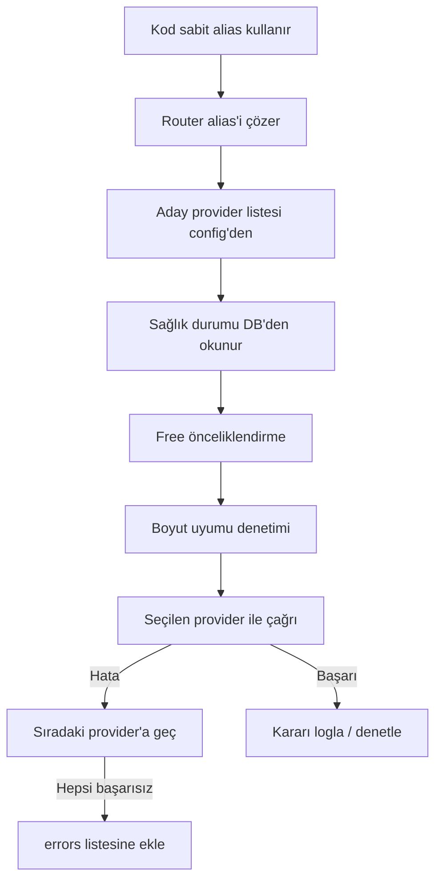

# 9R-05 — Akıllı Provider Yönlendirici (Smart Provider Router) Planı

> Tarih: 2026-09-12
> Amaç: Sabit model adı (alias) üzerinden, script'in arka planda **free öncelikli** provider seçmesi,
> kararların ölçülüp denetlenmesi, hata durumlarında otomatik fallback.

## 1. Problem

- 9router combo modelleri sürekli değişiyor (model ekleniyor/kaldırılıyor).
- Kullanıcı hangi modelin gerçekten çalıştığını ve hangisinin **bedava (free)** olduğunu takip edemiyor.
- İstenen: Kullanıcı/kod **sabit bir ad** kullanır (örn. `combo-embed`), script arka planda
  free + sağlıklı provider'ı seçer, kararı ölçer ve denetler.

## 2. Önerilen Yaklaşım: Alias Tabanlı Akıllı Yönlendirici

Yeni modül: `src/company_master/gateway/provider_router.py`

### 2.1 Sabit Alias'lar

| Alias | Capability | Çözülen adaylar (config) |
|-------|-----------|--------------------------|
| `combo-embed` | Embedding | openai → gemini → jina-ai |
| `combo-fetch` | Web fetch | firecrawl → jina-reader → tavily |
| `combo-search` | Web search | tavily → exa → brave |

Kod tarafında `embed()` / `web_fetch()` / `web_search()` varsayılan model parametresi bu alias'ı kullanır.
Router, alias'ı gerçek modele çözer.

## 3. Script Kriterleri (Öncelik Sırası)

1. **Sağlık:** `testStatus=available`, `modelLock_*` yok, `backoffLevel=0`, `rateLimitedUntil` geçmiş.
2. **Maliyet:** free öncelikli (pricing bilgisi — kaynak aşağıda netleştirilecek).
3. **Boyut uyumu:** embedding dimension, ChromaDB collection dimension ile eşleşmeli.
4. **Canlı mevcudiyet:** `/v1/models/<kind>` içinde model gerçekten var mı (periyodik doğrulama).

## 4. Adımlar

1. Alias'i çöz → aday listesi (config).
2. Her aday için DB `providerConnections.data` JSON'dan sağlık durumunu oku.
3. Free + sağlıklı adayları öne al (öncelik sıralaması).
4. Embedding ise boyut uyumunu denetle.
5. Seçilen provider ile çağrı yap.
6. Başarısızsa sıradaki adaya geç (fallback).
7. Kararı logla: alias, seçilen provider, neden (free/sağlık/fallback), süre, sonuç.

## 5. Hata Davranışı

- Seçilen provider başarısız → sıradaki adaya geç.
- Hepsi başarısız → `errors` listesine ekle + hata raporu.
- `401` → `NINEROUTER_KEY` yenileme uyarısı.
- `503 All accounts unavailable` → `retry-after` bekle veya provider ekle.
- `400 Invalid model format` → model `/v1/models/<kind>` içinde yok; aday listesinden çıkar.

## 6. Denetim / Ölçüm

- Karar geçmişi: `data/router/karar_gecmisi.jsonl` (her karar bir satır).
- Alanlar: `ts`, `alias`, `secili_provider`, `neden`, `sure_ms`, `basarili`, `hata`.
- Periyodik sağlık taraması: `scripts/9r_provider_health.py` → DB'den provider durumu raporu.

## 7. KRİTİK KISIT — Embedding Boyut Uyumu

Farklı embedding modelleri farklı boyut üretir:

| Model | Boyut |
|-------|-------|
| openai/text-embedding-3-small | 1536 |
| gemini/text-embedding-004 | 768 |
| jina-ai/jina-embeddings-v3 | 1024 |

ChromaDB collection **sabit boyut** kullanır (`DEFAULT_DIM`). Model değişirse boyut değişir →
collection bozulur. Çözüm seçenekleri:
- **A)** Fallback zincirinde yalnız **aynı boyutlu** modeller kullan (örn. hepsi 1536).
- **B)** Boyut değişince collection'ı yeniden oluştur (re-index) — maliyetli.
- **C)** Sabit boyuta normalize et (padding/truncation) — önerilmez, kalite kaybı.

**Öneri: A** — aynı boyutlu modeller. Router boyut uyumunu denetler.

## 8. Free Bilgisi Kaynağı (Netleştirilecek)

9router `/v1/models` yanıtında `owned_by:"combo"` var ama **pricing/free bilgisi yok**.
Free bilgisi nereden gelecek?
- **A)** Yapılandırılabilir config dosyası (free model listesi elle tanımlanır) — en güvenilir.
- **B)** 9router `/v1/models/info?id=<model>` endpoint'inden pricing (varsa).
- **C)** DB `providerConnections.data` içindeki pricing (varsa).

## 9. Mevcut Sistemle Entegrasyon

- openai embedding provider'ı DB'de (`providerConnections`) — router bunu okur.
- `embed()` varsayılan modeli `openai/text-embedding-3-small` → `combo-embed` alias'ına çevrilir.
- `DEFAULT_EMBED_MODEL` sabiti senkronize edilir.
- `Embedder._embed_chunk` model listesi üzerinden fallback yapar (ikincil yedek).
