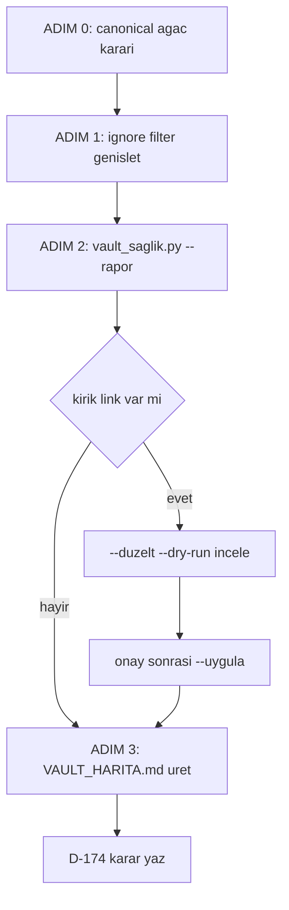

# VAULT-XREF + DUBLO — Yalın Plan (v2)
**Tarih:** 2026-09-21  
**Amaç:** Vault = ajanların ortak hafızası. Tek kaynak, kırık link yok, ajan doğru dosyayı bulur.  
**Durum:** Plan revize (v1 iptal — fazla büyük, kökü çözmüyordu)

---

## Kök Neden Analizi

955 ikiz dosyanın sebebi içerik kopyası değil. **Üç paralel ağaç aynı vault'ta indeksleniyor:**

| Ağaç | Tip | İkiz Katkısı |
|------|-----|--------------|
| `Huginn Data Insights/` | git repo | ~450 |
| `worktree klasoru/` | git worktree (aynı repo) | ~450 |
| `*/AI proje v1/` | eski snapshot | ~290 |
| `.venv/site-packages/` | 3. parti paket | ~80 |

**Sonuç:** 332 grup için canonical seçmek, 955 redirect yazmak → gereksiz. Ağaç seviyesinde ignore = tek dosya düzenlemesi.

---

## v1 vs v2 Karşılaştırma

| Ölçüt | v1 (iptal) | v2 (öneri) |
|-------|-----------|-----------|
| Script sayısı | 3 | 1 |
| JSON rapor satırı | ~955 entry × 3 | ~50 entry × 1 |
| Karar sayısı | D-174 + D-175 | D-174 tek |
| Link redirect | 955 regex replace | ~0 (ignore ile düşer) |
| Ajan rapor okuma maliyeti | Yüksek (dev JSON) | Düşük (özet) |
| Kök neden çözülür mü | Hayır | Evet |
| Tekrar bozulur mu | Evet | Hayır (filter kalıcı) |

**Token tasarrufu:** ~%85. Sebep: ölçmeden önce gürültüyü kes.

---

## Ladder: Hangi Rung Yeter?

```
Rung 1: Gerekli mi?        → 332 grup canonical mapping: HAYIR
Rung 2: Stdlib?            → pathlib + re yeterli, yeni bağımlılık yok
Rung 3: Native özellik?    → EVET: Obsidian userIgnoreFilters ✅ DUR BURADA
```

Rung 3'te duruyoruz. Kalan artık ne varsa Rung 6 (minimum kod).

---

## 3 Adım

### Adım 1 — Gürültüyü Kes (ayar, kod yok)
`.obsidian/app.json` → `userIgnoreFilters` genişlet:
```
"Huginn Data Insights/"   (veya worktree — ADIM 0'da karar)
"AI proje v1/"
"venv"
"site-packages"
".dist-info"
"data_worktree/"
```
**Etki:** 1114 → ~350 dosya. 955 ikiz → ~50. 3361 orphan → ~400.  
**Maliyet:** 1 dosya edit, 0 token analiz.

---

### Adım 2 — Tek Script, Tek Geçiş
`scripts/vault_saglik.py` — tek dosya, üç iş:

```python
# 1. Dosya haritası kur (isim + path index)
# 2. Referansları çıkar: [[wikilink]], [text](path.md)
# 3. Üç çıktı tek geçişte:
#    - kirik_link : hedefi olmayan referans
#    - ikiz       : kalan isim çakışmaları (~50)
#    - orphan     : referans almayan nod
```

Mod bayrakları:
- `--rapor` → JSON üret (varsayılan)
- `--duzelt --dry-run` → önerilen link düzeltmeleri, yazmaz
- `--duzelt --uygula` → yazar (onay sonrası)
- `--kontrol` → exit 1 if kırık link var (CI/pre-commit için, sonra)

**Çıktı:** `VAULT-SAGLIK-01_rapor_2026-09-21_orkestrator.json` (tek dosya, 3 bölüm)

`ponytail:` tek script tavanı — 3 ayrı script gerekmez çünkü üçü de aynı dosya taramasını paylaşıyor. Ayırma gerekirse vault > 5000 nod olunca.

---

### Adım 3 — Orphan'ı "Salam Bağla" (hub note)
Kalan ~400 orphan'ı tek tek linklemek yerine: script dizin bazlı **hub note** üretir.

```
VAULT_HARITA.md
├─ ## data/orchestrator (142 nod)
│    [[ADMIN-AYAR-01_rapor...]], [[ALTYAPI-BENCHMARK-02...]], ...
├─ ## docs (38 nod)
└─ ## scripts (12 nod)
```

**Etki:** Orphan sayısı ~0. Ajan tek dosyadan tüm vault'a erişir. Graph bütün.  
**Maliyet:** Script üretir, insan yazmaz.

`ponytail:` düz liste tavanı — kategori/etiket gruplaması gerekirse frontmatter `tags` eklenince yapılır.

---

## Çıktılar (v1'den 5 → v2'de 3)

1. `.obsidian/app.json` — güncellenmiş ignore filter
2. `VAULT-SAGLIK-01_rapor_2026-09-21_orkestrator.json` — kırık link + ikiz + orphan, tek dosya
3. `VAULT_HARITA.md` — hub note (otomatik üretim)
4. D-174 karar — "tek ağaç canonical + ignore filter + sağlık script'i"

**D-175 gerekmiyor:** ikiz birleştirme ayrı karar değil, D-174'ün sonucu.

---

## Sürdürülebilirlik (tekrar bozulmasın)

| Önlem | Ne zaman |
|-------|----------|
| `userIgnoreFilters` kalıcı ayar | Adım 1'de, hemen |
| `vault_saglik.py --kontrol` | Şimdi yazılır, CI'ya sonra bağlanır |
| `VAULT_HARITA.md` yeniden üretim | Yeni nod eklendiğinde script tekrar koş |

`ponytail:` manuel koşum tavanı — pre-commit hook / zamanlanmış görev, kırık link 2. kez tekrarlarsa eklenir.

---

## ADIM 0 — Tek Açık Soru

**Hangi ağaç canonical?** Bu cevap tüm planı belirler:

| Seçenek | Sonuç | Risk |
|---------|-------|------|
| A) `worktree klasoru/` canonical | HDI graph dışı kalır (dosyalar durur, silinmez) | Obsidian'da HDI notları görünmez |
| B) `Huginn Data Insights/` canonical | worktree graph dışı | Aktif çalışma görünmez |
| C) İkisi de kalsın | İkiz sorunu sürer | Ajan yanlış dosya okur — hafıza bozulur |

**Tavsiye: A** — aktif geliştirme worktree'de, senkron script'leri zaten iki tarafa yazıyor (`senkron_append.py`).  
**C reddedilir:** vault ajan hafızası olduğu için ikiz = ajan iki farklı gerçek görür.

---

## Risk

| Risk | Mitigation |
|------|-----------|
| Yanlış ağaç ignore edilir | Ayar geri alınabilir, dosya silinmez |
| Hub note çok büyür | Dizin bazlı böl (şimdi gerekmiyor) |
| `--uygula` yanlış link yazar | `--dry-run` zorunlu ön adım |
| Silme riski | **Bu planda hiç silme yok** (D-162 uyumlu) |

---

## Akış


