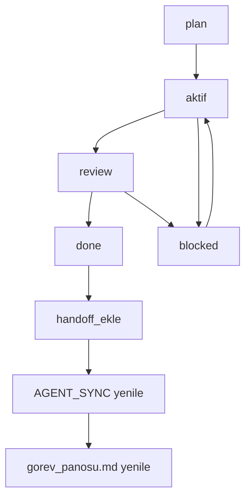
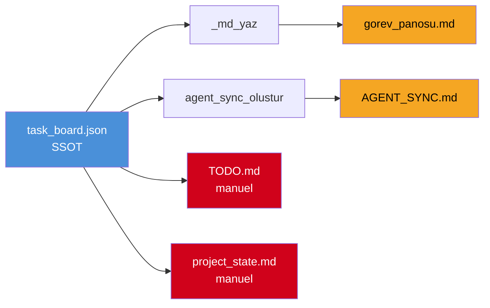
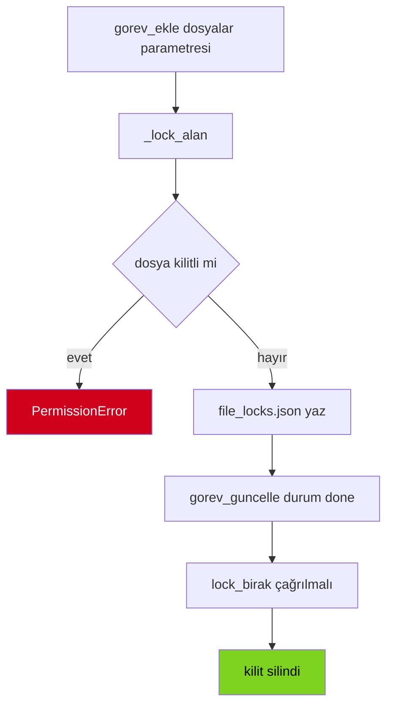

# Proje Durumu ve Görev Panosu Analizi — Plan

> Tarih: 2026-09-11
> Kaynak: [`task_board.json`](data/orchestrator/task_board.json:1) · [`gorev_panosu.md`](data/orchestrator/gorev_panosu.md:1) · [`AGENT_SYNC.md`](AGENT_SYNC.md:1) · [`project_state.md`](AI%20proje%20v1/V10/project_state.md:1) · [`file_locks.json`](data/orchestrator/file_locks.json:1) · [`TODO.md`](AI%20proje%20v1/V10/TODO.md:1)

## 1. Mevcut Durum Özeti

### 1.1 Proje Fazı

Proje **Ankara B2B Company Master V1.0** fazında. Temel altyapı tamamlandı:

- 22 tablo Supabase üzerinde canlı, 4 migration uygulandı
- ETL pipeline 8313 OSTİM firmasını işledi
- NACE enrichment %84.8 tamamlandı
- OSINT Scraper Motoru v1 + Quality Gate aktif
- Job Intelligence modülü büyük ölçüde tamamlandı (P7-1..P7-11 done)
- Orkestratör QTK-01 tamamlandı, dispatch/review senkronizasyonu çalışıyor

### 1.2 Görev Panosu Sayıları

| Durum | Adet | Oran |
|-------|------|------|
| done | 32 | %78 |
| aktif | 3 | %7 |
| plan | 6 | %15 |
| blocked | 0 | %0 |
| **Toplam** | **41** | %100 |

> Not: [`task_board.json`](data/orchestrator/task_board.json:1) içinde 41 kayıt var. [`gorev_panosu.md`](data/orchestrator/gorev_panosu.md:1) içinde duplikasyon nedeniyle 26 satır görünüyor.

## 2. Tespit Edilen Senkronizasyon Sorunları

### 2.1 Kritik — Kaynak Uyumsuzluğu

| # | Sorun | Kaynak A | Kaynak B | Etki |
|---|-------|----------|----------|------|
| S-01 | DOCS-01/02/03 `done` ama AGENT_SYNC `plan` gösteriyor | [`task_board.json`](data/orchestrator/task_board.json:383) | [`AGENT_SYNC.md`](AGENT_SYNC.md:13) | İnsan okuması yanlış durum görüyor |
| S-02 | `gorev_panosu.md` içinde 8 görev duplike | [`gorev_panosu.md`](data/orchestrator/gorev_panosu.md:10) | [`gorev_panosu.md`](data/orchestrator/gorev_panosu.md:14) | Tablo şişiyor, kafa karışıklığı |
| S-03 | `TODO.md` güncel değil — P7-12..15, REFACTOR, TEST, VALIDATE, DOCS-04 yok | [`TODO.md`](AI%20proje%20v1/V10/TODO.md:10) | [`task_board.json`](data/orchestrator/task_board.json:320) | V10 kanonik doküman eksik |
| S-04 | `file_locks.json` P7-12 kilidi hâlâ duruyor ama görev `done` | [`file_locks.json`](data/orchestrator/file_locks.json:2) | [`task_board.json`](data/orchestrator/task_board.json:322) | Dosya kilidi gereksiz yere tutuluyor |
| S-05 | DOCS-01/02/03 `baslangic` > `bitis` zaman tersliği | [`task_board.json`](data/orchestrator/task_board.json:388) | — | Veri bütünlüğü hatası |
| S-06 | `AGENT_SYNC.md` son güncelleme 19:43:30 ama DOCS done 16:28 sonrası senkronize edilmemiş | [`AGENT_SYNC.md`](AGENT_SYNC.md:3) | [`task_board.json`](data/orchestrator/task_board.json:389) | Otomatik senkron tetiklenmemiş |

### 2.2 Orta — Yapısal Sorunlar

| # | Sorun | Açıklama |
|---|-------|----------|
| S-07 | `gorev_panosu.md` Aktif İşler tablosunda `P7-13` ve `P7-14` hem `aktif` hem `plan` olarak iki kez listeleniyor | [`task_board.py:_md_yaz()`](src/company_master/orchestrator/task_board.py:376) fonksiyonu duplikasyonu filtrelemiyor |
| S-08 | `project_state.md` son güncelleme QTK-01 sonrası kalmış, P7-12..15 ve DOCS yok | [`project_state.md`](AI%20proje%20v1/V10/project_state.md:46) |
| S-09 | `QT-001` harici ajan görevi `aktif` ama `file_locks.json` içinde kilidi yok | Tutarlılık kontrolü eksik |

## 3. Görev Panosu Detay Analizi

### 3.1 Aktif Görevler — 3 adet

| ID | Başlık | Sahip | Öncelik | Kilit | Risk |
|----|--------|-------|---------|-------|------|
| P7-13 | MCP -> OSINT Motoru Bridge | kilo | P1 | `iskur.py` kilitli | Yüksek — P7-12 kilidi ile çakışma potansiyeli |
| P7-14 | E2E Pipeline Test | kilo | P1 | `kariyer_net.py` kilitli | Orta — fixture/CI bağımlılığı |
| QT-001 | Test research task | claude_code | P1 | kilit yok | Düşük — harici ajan |

### 3.2 Plan Durumundaki Görevler — 6 adet

| ID | Başlık | Sahip | Öncelik | Dosyalar | Architect Yapabilir mi |
|----|--------|-------|---------|----------|------------------------|
| P7-15 | Signal Dashboard / Aggregation | kilo | P2 | - | Hayır — dashboard kodu |
| REFACTOR-01 | `gorev_guncelle()` not keyword temizle | mimar | P2 | [`task_board.py`](src/company_master/orchestrator/task_board.py:116) | Hayır — .py dosyası |
| TEST-01 | Review başarısız senaryo testi ekle | mimar | P1 | [`test_dispatch_review.py`](tests/orchestrator/test_dispatch_review.py:1) | Hayır — .py dosyası |
| VALIDATE-01 | quick_task.py uçtan uca validasyon | external_agent | P1 | [`quick_task.py`](scripts/quick_task.py:1) | Hayır — harici ajan |
| DOCS-04 | Brief.package() birleştirme | mimar | P3 | [`models.py`](src/company_master/orchestrator/models.py:158) + [`brief.py`](src/company_master/orchestrator/brief.py:1) | Kısmen — doküman kısmı evet, kod kısmı hayır |
| P7-4 | Company Career Pages Scraper | web_kazima | plan | - | Hayır |
| P7-5 | İSKUR Scraper | kazi_scraper | plan | - | Hayır |
| P7-6 | Kariyer.net Scraper | web_kazima | blocked | - | Hayır |

> **Architect modunda doğrudan yapılabilecek görev yok.** Tüm plan görevler `.py` dosyası gerektiriyor. Architect yalnızca `.md` düzenleyebilir.

### 3.3 Tamamlananlar — Son 5

| ID | Başlık | Sahip | Bitiş |
|----|--------|-------|-------|
| DOCS-03 | AGENTS.md güncelle | mimar | 2026-09-11T16:33:50 |
| DOCS-02 | 07_harici_ajan_protokolu.md | mimar | 2026-09-11T16:29:36 |
| DOCS-01 | Orchestrator README | mimar | 2026-09-11T16:28:04 |
| ROO-01 | Roo Code inceleme | roo_code | 2026-09-11T17:47:03 |
| LIVE-01 | Canlı Test Dispatch+Review | cursor_grok | 2026-09-11T17:43:42 |

## 4. Dosya Kilidi Analizi

```
file_locks.json — 3 aktif kilit
├── src/company_master/intelligence/job_intelligence/ → mimar / P7-12 / 2026-09-11T13:21:19
├── src/company_master/intelligence/job_intelligence/sources/iskur.py → kazi_scraper / P7-13 / 2026-09-11T13:21:19
└── src/company_master/intelligence/job_intelligence/sources/kariyer_net.py → kazi_scraper / P7-14 / 2026-09-11T13:21:19
```

**Sorun:** P7-12 `done` olmasına rağmen dizin kilidi hâlâ duruyor. [`task_board.py:lock_birak()`](src/company_master/orchestrator/task_board.py:317) çağrılmamış.

**Öneri:** P7-12 kilidi manuel bırakılmalı veya `gorev_guncelle(durum=done)` içinde otomatik bırakma eklenmeli.

## 5. Mimari Diyagramlar

### 5.1 Görev Yaşam Döngüsü



### 5.2 Senkronizasyon Akışı — Mevcut ve Hedef



> Kırmızı kutular manuel senkron gerektiriyor — otomasyon eksik.

### 5.3 Dosya Kilidi Mekanizması



## 6. Önerilen Plan — 4 Faz

### Faz 1: Senkronizasyon Düzeltmeleri — Kritik

| # | Görev | Dosya | İşlem | Öncelik |
|---|-------|-------|-------|---------|
| 1.1 | `gorev_panosu.md` duplikasyonunu düzelt | [`task_board.py:_md_yaz()`](src/company_master/orchestrator/task_board.py:376) | Duplike filtre ekle + manuel düzelt | P0 |
| 1.2 | `AGENT_SYNC.md` yeniden üret | [`task_board.py:agent_sync_yaz()`](src/company_master/orchestrator/task_board.py:273) | `agent_sync_yaz()` çağır | P0 |
| 1.3 | P7-12 kilidini bırak | [`file_locks.json`](data/orchestrator/file_locks.json:2) | `lock_birak()` çağır | P0 |
| 1.4 | DOCS zaman tersliğini düzelt | [`task_board.json`](data/orchestrator/task_board.json:388) | `baslangic` < `bitis` yap | P1 |
| 1.5 | `TODO.md` güncelle | [`TODO.md`](AI%20proje%20v1/V10/TODO.md:1) | P7-12..15 + REFACTOR/TEST/VALIDATE/DOCS-04 ekle | P1 |
| 1.6 | `project_state.md` güncelle | [`project_state.md`](AI%20proje%20v1/V10/project_state.md:1) | Son tamamlananları ekle | P1 |

### Faz 2: Architect Modunda Yapılabilecek Dokümantasyon Görevleri

| # | Görev | Açıklama | Dosya |
|---|-------|----------|-------|
| 2.1 | SYNC-01: Senkronizasyon otomasyon dokümanı | `task_board.json` → `gorev_panosu.md` + `AGENT_SYNC.md` + `TODO.md` + `project_state.md` akışını dokümante et | `AI proje v1/V10/08-Ajanlar/09_senkronizasyon_protokolu.md` |
| 2.2 | DOCS-05: File lock protokolü dokümanı | `file_locks.json` kullanım kılavuzu, `lock_birak` ne zaman çağrılır | `AI proje v1/V10/08-Ajanlar/10_dosya_kilidi_protokolu.md` |
| 2.3 | DOCS-06: Görev panosu kullanım kılavuzu | Yeni ajan için `gorev_ekle`, `gorev_guncelle`, `handoff_ekle` örnekleri | `src/company_master/orchestrator/GOREV_PANOSU_KILAVUZU.md` |

### Faz 3: Kod Moduna Devredilecek Görevler

| # | Görev | Neden Kod Modu |
|---|-------|----------------|
| 3.1 | REFACTOR-01 | [`task_board.py`](src/company_master/orchestrator/task_board.py:116) `.py` dosyası |
| 3.2 | TEST-01 | [`test_dispatch_review.py`](tests/orchestrator/test_dispatch_review.py:1) `.py` dosyası |
| 3.3 | DOCS-04 | [`models.py`](src/company_master/orchestrator/models.py:158) + [`brief.py`](src/company_master/orchestrator/brief.py:1) `.py` dosyası |
| 3.4 | Faz 1 düzeltmeleri (1.1, 1.3, 1.4) | `.py` ve `.json` dosyaları |

### Faz 4: Harici Ajana Devredilecek Görevler

| # | Görev | Ajan | Neden Harici |
|---|-------|------|--------------|
| 4.1 | VALIDATE-01 | external_agent | `quick_task.py` uçtan uca validasyon — harici ajan perspektifi gerekli |
| 4.2 | P7-15 | kilo (iç) veya harici | Dashboard — araştırma + prototip için harici ajan uygun |

## 7. Riskler ve Öneriler

### 7.1 Riskler

| Risk | Olasılık | Etki | Önlem |
|------|----------|------|-------|
| Duplike görevler nedeniyle ajanlar yanlış dosyaya dokunabilir | Yüksek | Orta | Faz 1.1 hemen yapılmalı |
| Kilit bırakılmadığı için P7-13/14 bloke olabilir | Orta | Yüksek | Faz 1.3 hemen yapılmalı |
| TODO.md güncel olmadığı için yeni ajanlar eski plana göre çalışabilir | Yüksek | Orta | Faz 1.5 yapılmalı |
| Zaman tersliği raporlamayı bozuyor | Düşük | Düşük | Faz 1.4 düzelt |

### 7.2 Sezgisel Uyarılar

1. **VPN kuralı:** Ağ işlemleri timeout verirse VPN'i kontrol et — [`AGENTS.md`](AGENTS.md:59) kuralı.
2. **MVP kuralı:** Veri tabanı ve iş akışı kanıtlanmadan web arayüzüne geçilmemeli — Streamlit öncelikli.
3. **Gizli bilgi:** `.env` asla harici ajana gönderilmemeli — [`AGENTS.md`](AGENTS.md:76) kuralı.
4. **Türkçe karakter:** Tüm `.md` dosyaları UTF-8 kaydedilmeli, BOM kontrolü yapılmalı.

## 8. Sonraki Adımlar — Onay Beklenen Kararlar

1. **Faz 1 düzeltmeleri için kod moduna geçiş onaylanıyor mu?** Architect yalnızca `.md` düzenleyebilir, `.json`/`.py` için kod modu gerekli.
2. **Faz 2 dokümantasyon görevleri oluşturulsun mu?** 3 yeni doküman görevi `task_board.json`'a eklenecek.
3. **P7-12 kilidi manuel bırakılsın mı?** Yoksa `gorev_guncelle` içine otomatik bırakma mı eklensin?
4. **TODO.md ve project_state.md manuel mi güncellensin, otomatik senkron mu kurulsun?**

---

## Ek: Hızlı Bakış — Tüm Görevler

```
Aktif:  P7-13, P7-14, QT-001
Plan:   P7-15, REFACTOR-01, TEST-01, VALIDATE-01, DOCS-04, P7-4, P7-5, P7-6
Done:   32 görev (P0-1..P0-5, APIFY-01..03, MCP-01..03, OSINT-01..02, P7-1..3, P7-7..10, P7-TEST, QTK-01, DOCS-01..03, RO-02, LIVE-01, ROO-01, vb.)
```

> Detaylı görev listesi: [`task_board.json`](data/orchestrator/task_board.json:1) — 41 kayıt
> İnsan okuması: [`gorev_panosu.md`](data/orchestrator/gorev_panosu.md:1) — duplikasyon var, düzeltme gerekli
> Ajan senkronu: [`AGENT_SYNC.md`](AGENT_SYNC.md:1) — stale, yenilenmeli
