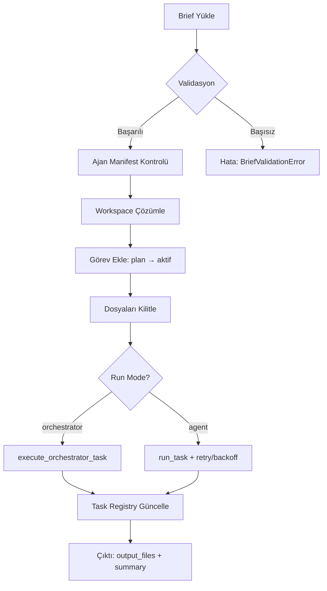
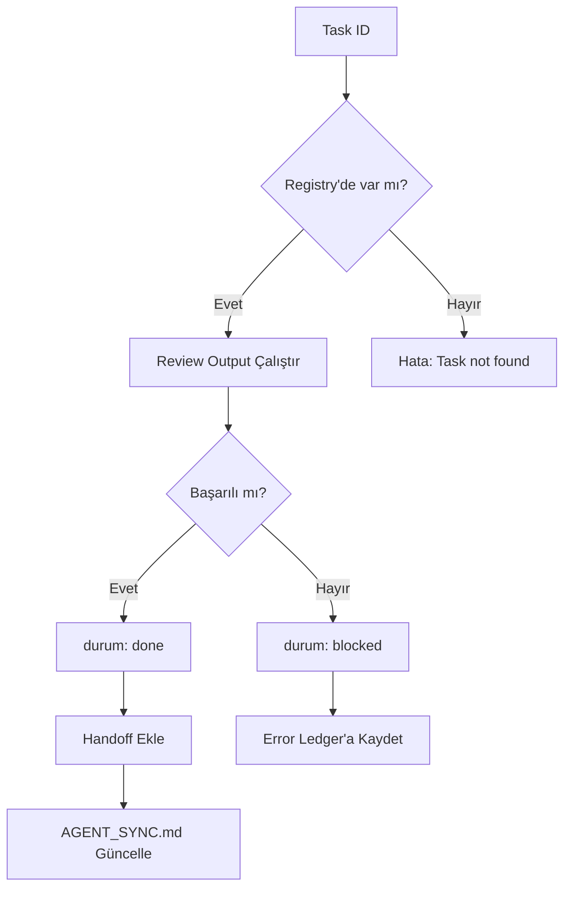

[[Huginn Data Insights/data/skills/supabase/README.md]]

# Huginn Data Insights Orchestrator

Bu modül, çoklu ajan koordinasyonu, görev yönetimi, dosya kilitleme ve senkronizasyon sistemini sağlar.

## Amaç

- **Merkezi görev yönetimi**: Tüm ajanlar (iç + harici) tek bir panodan görev alır
- **Çakışma önleme**: Dosya kilitleme mekanizması ile aynı dosyada paralel değişiklik engellenir
- **Otomatik senkronizasyon**: `AGENT_SYNC.md` dosyası otomatik olarak güncellenir
- **Hata yönetimi**: Retry mekanizması, context decay ve error ledger

## Bileşenler

### Temel Modüller

| Modül | Açıklama |
|-------|----------|
| [`cli.py`](cli.py) | Click tabanlı CLI arayüzü (`dispatch`, `review`, `status`, `error-log`) |
| [`task_board.py`](task_board.py) | Görev panosu yönetimi (CRUD operasyonları, dosya kilitleme) |
| [`models.py`](models.py) | Veri modelleri (`Task`, `Brief`, `TaskResult`, `AgentManifest`, enum'lar) |
| [`runner.py`](runner.py) | Görev çalıştırma motoru (manifest bazlı, orchestrator/agent modu) |
| [`review.py`](review.py) | Görev çıktısı inceleme ve kalite kontrolü |
| [`sync.py`](sync.py) | `AGENT_SYNC.md` otomatik üretimi ve güncelleme |
| [`brief.py`](brief.py) | Brief validasyonu ve yükleme |
| [`workspace.py`](workspace.py) | Harici ajan workspace izolasyonu ve path güvenliği |
| [`error_ledger.py`](error_ledger.py) | Hata kayıtları ve retry istatistikleri |
| [`health_check.py`](health_check.py) | Sistem sağlık kontrolü |
| [`auto_assign.py`](auto_assign.py) | Otomatik görev atama (ajana göre) |
| [`internal.py`](internal.py) | İç ajan yardımcı fonksiyonları |

### Testler

- `tests/orchestrator/test_dispatch_review.py` — Dispatch + review akışı (36 test)
- `tests/orchestrator/test_task_board.py` — Görev panosu CRUD
- `tests/orchestrator/test_workspace.py` — Workspace izolasyonu

## Ana Akışlar

### 1. Görev Dağıtımı (`dispatch`)



**CLI Kullanımı:**
```bash
python -m src.company_master.orchestrator.cli dispatch path/to/brief.json --run-mode orchestrator
```

### 2. Görev İncelemesi (`review`)



**CLI Kullanımı:**
```bash
python -m src.company_master.orchestrator.cli review TSK-001 --output-dir ./output/
```

### 3. Dosya Kilitleme Mekanizması

```python
# Gorev ekle ve dosyaları kilitle
gorev_ekle(
    task_id="DOCS-01",
    baslik="Orchestrator README yaz",
    sahip="mimar",
    oncelik="P1",
    dosyalar=["src/company_master/orchestrator/README.md"]
)
# → file_locks.json'a otomatik kayıt atar

# İş bitince kilidi bırak
lock_birak("src/company_master/orchestrator/README.md", sahip="mimar")
```

**Kilit Kontrolü:**
```python
from src.company_master.orchestrator.task_board import locklar

aktif_locklar = locklar()
# {"src/company_master/orchestrator/README.md": {"sahip": "mimar", "task_id": "DOCS-01"}}
```

## Veri Modelleri

### TaskStatus Enum
```python
class TaskStatus(str, Enum):
    PENDING = "pending"        # Beklemede
    DISPATCHED = "dispatched"  # Dağıtıldı
    RUNNING = "running"        # Çalışıyor
    COMPLETED = "completed"    # Tamamlandı
    FAILED = "failed"          # Başarısız
    REASSIGNED = "reassigned"  # Yeniden atandı
    REVIEWED = "reviewed"      # İncelendi
```

### Task Dataclass
```python
@dataclass
class Task:
    task_id: str
    agent_id: str
    task_type: TaskType
    brief_path: str
    context_files: list[str]
    constraints: dict[str, Any]
    success_criteria: list[str]
    deadline: str | None
    status: TaskStatus
    attempts: int
    result: TaskResult | None
    source: str | None  # "ic" veya "harici"
```

### Brief Dataclass
```python
@dataclass
class Brief:
    agent_id: str
    task_id: str
    task_type: TaskType
    title: str
    brief_path: str
    context_files: list[str]
    constraints: dict[str, Any]
    success_criteria: list[str]
    deadline: str | None
    source: str | None  # "ic" veya "harici"
    from_agent: str | None
    run_mode: str | None  # "orchestrator" veya "agent"
```

## Desteklenen Ajanlar

| Agent ID | Display Name | Task Type | Workspace |
|----------|--------------|-----------|-----------|
| `cursor_grok` | Cursor Grok | code_review | `workspace/external/cursor_grok` |
| `copilot` | GitHub Copilot | refactoring | `workspace/external/copilot` |
| `claude_code` | Claude Code | research | `workspace/external/claude_code` |
| `roo_code` | Roo Code | code_review | `workspace/external/roo_code` |
| `harici_ajan` | Harici Ajan (Inkling) | research | `workspace/external/harici_ajan` |

## Güvenlik ve Kısıtlar

### Workspace İzolasyonu
- Harici ajanlar **yalnızca** `workspace/external/{agent_id}/` dizininde çalışabilir
- Proje köküne doğrudan erişim **yasak** (path traversal koruması)
- `.env`, gizli anahtarlar, KVKK verileri harici ajana **gönderilmez**

### Dosya Erişimi
- Tüm dosya yazma işlemleri `resolve_workspace()` üzerinden geçer
- Path traversal saldırılarına karşı `validate_path()` kontrolü
- Çalışma alanı dışına çıkış engellenir

### Secret Taraması
- API anahtarları, token'lar ve şifreler otomatik taranır
- `.env` dosyaları görev context'i dışında tutulur
- Hardcoded secret'lar CI pipeline'da reddedilir

## Quick Task Wrapper

`scripts/quick_task.py` ile hızlı görev oluşturma:

```bash
# Harici ajan için görev oluştur ve çalıştır
python scripts/quick_task.py \
  --agent claude_code \
  --task-id RESEARCH-01 \
  --title "API araştırması" \
  --brief path/to/brief.json \
  --review

# --review flag'i ile otomatik inceleme
```

**Python API:**
```python
from scripts.quick_task import quick_task

result = quick_task(
    agent_id="claude_code",
    task_id="RESEARCH-01",
    title="API araştırması",
    brief_path="path/to/brief.json",
    source="harici",
    auto_review=True
)
```

## Koordinasyon Protokolleri

### 1. Task Board (`task_board.json`)
- **Tek doğru kaynak**: Tüm görevler burada tanımlı
- **Durum akışı**: `plan → aktif → review → done` veya `blocked`
- **Otomatik senkron**: `gorev_panosu.md` olarak dışa aktarılır

### 2. Handoffs (`handoffs.json`)
- Tamamlanan görevlerin çıktıları ve özetleri
- Duplicate-safe: Aynı `task_id` için `guncelleme_gecmisi` tutulur
- Her kayıt: tamamlanma zamanı, sonraki adım, output_path, özet

### 3. File Locks (`file_locks.json`)
- Eşzamanlı dosya erişim çakışmalarını önler
- Her görev `dosyalar` parametresi ile kilitlenmesini zorunlu kılar
- Kilitler görev tamamlandığında serbest bırakılır (`lock_birak()`)

### 4. AGENT_SYNC.md
- İnsan tarafından okunabilir geçmiş ve durum
- Otomatik üretilir (`sync.agent_sync_yaz()`)
- **Elle büyük yeniden yazım yapmayın**

## Test Çalıştırma

```bash
# Tüm orchestrator testleri
python -m pytest tests/orchestrator/ -v

# Tek bir test
python -m pytest tests/orchestrator/test_dispatch_review.py::test_dispatch_review_success -v

# Coverage raporu
python -m pytest tests/orchestrator/ --cov=src/company_master/orchestrator --cov-report=html
```

## Örnek Kullanım Senaryoları

### Senaryo 1: İç Ajan Görevi
```python
from src.company_master.orchestrator.task_board import gorev_ekle, gorev_guncelle

# Görev oluştur
gorev_ekle(
    task_id="DOCS-01",
    baslik="Orchestrator README yaz",
    sahip="mimar",
    oncelik="P1",
    dosyalar=["src/company_master/orchestrator/README.md"]
)

# İşe başla
gorev_guncelle("DOCS-01", durum="aktif")

# İş bitince
gorev_guncelle("DOCS-01", durum="done", bitis="2026-09-11T16:30:00")
```

### Senaryo 2: Harici Ajan Görevi
```bash
# Brief oluştur
cat > workspace/external/claude_code/brief.json <<EOF
{
  "agent_id": "claude_code",
  "task_id": "RESEARCH-01",
  "task_type": "research",
  "title": "API araştırması",
  "context_files": ["docs/api_spec.md"],
  "constraints": {"max_tokens": 3000},
  "success_criteria": ["API endpoint listesi", "Örnek kullanım"],
  "source": "harici"
}
EOF

# Dispatch
python -m src.company_master.orchestrator.cli dispatch workspace/external/claude_code/brief.json

# Review
python -m src.company_master.orchestrator.cli review RESEARCH-01
```

## Troubleshooting

### Hata: `PermissionError: Dosya kilitli`
**Neden:** Başka bir ajan aynı dosyada çalışıyor
**Çözüm:** `data/orchestrator/file_locks.json` dosyasını kontrol et, kilidi bırakan ajana bekle veya kullanıcıya danış

### Hata: `WorkspaceViolation: Path traversal detected`
**Neden:** Harici ajan workspace dışına çıkmaya çalışıyor
**Çözüm:** Brief'teki `context_files` yollarını kontrol et, yalnızca `workspace/external/{agent_id}/` altında kal

### Hata: `BriefValidationError: Missing required field`
**Neden:** Brief JSON'unda zorunlu alanlar eksik
**Çözüm:** `agent_id`, `task_id`, `task_type`, `title`, `brief_path` alanlarını kontrol et

## İlgili Dokümanlar

- [[AI proje v1/V10/08-Ajanlar/07_harici_ajan_protokolu]] — Harici ajan entegrasyon kuralları
- [[AI proje v1/V10/08-Ajanlar/08_harici_ajan_gorev_onerileri]] — Görev önerileri
- [[AGENT_SYNC]] — Canlı durum ve hata kayıtları
- Ana bağlam: `AI proje v1/V10/05_versiyonlar/01_versiyon_9_baglam_dokumani.md`

## Destek

Sorular için:
1. `AGENT_SYNC.md` → "ErrorLedger" bölümünü kontrol et
2. `data/orchestrator/task_board.json` → Görev durumunu incele
3. Kullanıcıya veya Ürün Sahibi'ne danış

---

**Son güncelleme:** 2026-09-11
**Versiyon:** 1.0
**Bakım:** mimar ajanı
